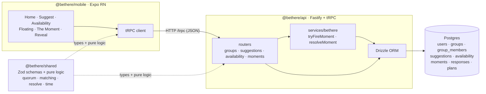

# Architecture

BeThere is a pnpm monorepo: an Expo React Native client talks to a Fastify + tRPC
API backed by Postgres, with a shared Zod/types package that wires the type chain
end-to-end. The walking skeleton now implements the **full loop** —
suggest → availability → silent matching → the moment → clear (a firm plan) or a
silent fizzle — partially functional and DB-backed.

## Components



Plain-text fallback:

```
[Expo RN: 6 screens] --tRPC/HTTP--> [Fastify + tRPC API] --Drizzle--> [Postgres: 8 tables]
          ^                                  ^
          |            @bethere/shared        |
          +--- Zod types + matching/resolve --+
```

## The loop

```mermaid
sequenceDiagram
  participant U as User (mobile)
  participant A as API (tRPC)
  participant DB as Postgres
  U->>A: suggestions.create { activity, window, group }
  A->>DB: insert suggestion (collecting)
  U->>A: availability.drop { slots }  (PRIVATE)
  A->>DB: insert availability
  Note over A: findClearingSlot() — a slot where ≥ quorum are free?
  A->>DB: if so, insert moment (open) + fire
  A-->>U: { floating, firedMomentId }
  U->>A: moments.mine
  A-->>U: proposal { title, place, detail, msLeft, members }  (no participant ids / tally)
  U->>A: moments.respond { yes | no | conditional }
  A-->>U: { recorded }  (no tally)
  U->>A: moments.resolve
  Note over A: resolveIn() resolves conditionals → IN set; compare to quorum
  A->>DB: cleared → insert plan · fizzled → silent
  A-->>U: cleared { inCount } | fizzled
  U->>A: moments.plan  (cleared only)
  A-->>U: the IN crowd + final details
```

## Packages

| Package | Role |
|---|---|
| `@bethere/shared` | Single source of truth: Zod schemas + framework-free pure logic — `quorumFor`, `findClearingSlot` (matching), `resolveIn`/`clears`/`findLinchpins` (conditional resolution), `slotToDate`/`defaultPlace`/`headlineFor`. Unit-tested with vitest. |
| `@bethere/api` | Fastify + tRPC server; Drizzle/Postgres; `groups`/`suggestions`/`availability`/`moments` routers; `services/bethere` holds the privacy-sensitive matching + resolution. Reseeds a replayable demo on boot. |
| `@bethere/mobile` | Expo RN; six screens driving the typed tRPC client through a lightweight `useState` route switcher. |

## Type chain

Zod schema in `@bethere/shared` → tRPC procedure in `@bethere/api` → `AppRouter`
type → typed client in `@bethere/mobile`. No hand-written API types. Mobile imports
`@bethere/api` **type-only**, so server code is never bundled by Metro. No `Date`
crosses the wire — procedures return epoch-ms numbers or preformatted strings.

## Privacy boundary (server-authoritative)

- `availability.*` returns only the caller's own data — never who else dropped, never a count.
- `moments.mine` returns proposal display fields + the **group's** members (to populate
  the "I'm in if…" picker — group membership is not secret) — never the moment's
  participant ids, others' responses, or any tally.
- `moments.respond` returns `{ recorded }` — never the running count (blind/equal).
- `moments.resolve` reveals the IN count on **clear**; on **fizzle** it reveals nothing.
- `moments.plan` is readable only by a participant and reveals only the IN crowd
  (they opted in — safe); No's / non-responders are never represented.

## Demo seeding

`reseedDemo()` runs on every boot: 3 users, a "Flatmates" group, and Maya's `food`
suggestion with Maya + Sam already free this evening. So when the dev user drops the
same slot, quorum (3) is met and a moment fires. When a moment fires,
`seedDemoPeerYeses` simulates the other matched people saying yes — a **demo-only**
affordance so a single tester can drive the loop to a real clear/fizzle. Removed when
real multi-user lands.

## Deferred (wired later, behind these interfaces)

The linchpin nudge **delivery** (the pure `findLinchpins` already exists), push
notifications, real-time updates, AI seeding of suggestions, calendar integration,
Lora/Inter fonts, and real auth (a dev user is read from an `x-user-id` header,
default `u_dev`).

## Run it

```bash
pnpm install
pnpm db:up                            # Postgres on localhost:5433
pnpm --filter @bethere/api db:migrate
pnpm dev:api                          # http://localhost:3000 (reseeds demo on boot)
pnpm dev:mobile                       # Expo
```
