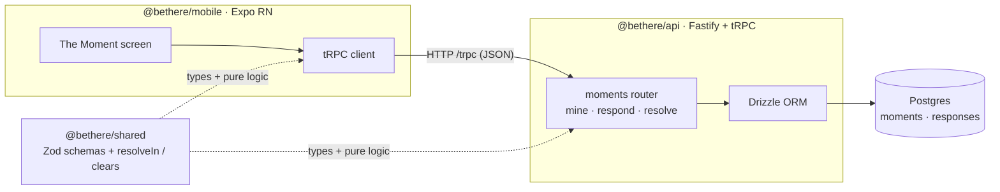

# Architecture

BeThere is a pnpm monorepo: an Expo React Native client talks to a Fastify + tRPC
API backed by Postgres, with a shared Zod/types package that wires the type chain
end-to-end. The walking skeleton implements one vertical slice — the **moment loop**.

## Components



Plain-text fallback:

```
[Expo RN: The Moment] --tRPC/HTTP--> [Fastify + tRPC API] --Drizzle--> [Postgres]
            ^                                ^
            |          @bethere/shared       |
            +------ Zod types + resolveIn ---+
```

## The moment loop

```mermaid
sequenceDiagram
  participant U as User (mobile)
  participant A as API (tRPC)
  participant DB as Postgres
  U->>A: moments.mine
  A->>DB: select open moment for me
  A-->>U: proposal { title, place, detail }  (no participant ids)
  U->>A: moments.respond { yes | no }
  A->>DB: upsert my response
  A-->>U: { recorded }  (no tally)
  U->>A: moments.resolve
  A->>DB: load responses
  Note over A: resolveIn() → IN set; compare to quorum
  A->>DB: update status = cleared | fizzled
  A-->>U: cleared { inCount } | fizzled
```

## Packages

| Package | Role |
|---|---|
| `@bethere/shared` | Single source of truth: Zod schemas + pure logic (`resolveIn`/`clears`), unit-tested with vitest. |
| `@bethere/api` | Fastify + tRPC server; Drizzle/Postgres; `moments` router; reseeds a demo moment on boot. |
| `@bethere/mobile` | Expo RN; one screen (The Moment) driving the typed tRPC client. |

## Type chain

Zod schema in `@bethere/shared` → tRPC procedure in `@bethere/api` → `AppRouter`
type → typed client in `@bethere/mobile`. No hand-written API types. Mobile imports
`@bethere/api` **type-only**, so server code is never bundled by Metro.

## Privacy boundary (server-authoritative)

- `mine` returns proposal display fields only — never participant ids or any tally.
- `respond` returns `{ recorded }` — never the running count (blind/equal).
- `resolve` reveals the IN count on **clear**; on **fizzle** it reveals nothing,
  not even how close it got.

## Deferred (not in the skeleton)

Suggestions / availability / matching, the linchpin nudge, push notifications,
real-time updates, real auth (a dev user is read from an `x-user-id` header,
default `u_dev`), and all other screens.

## Run it

```bash
pnpm install
pnpm db:up                            # Postgres on localhost:5433
pnpm --filter @bethere/api db:migrate
pnpm dev:api                          # http://localhost:3000
pnpm dev:mobile                       # Expo
```
