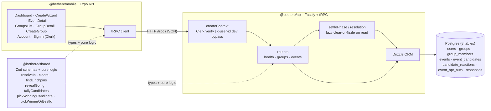

# Architecture

BeThere is a pnpm monorepo: an Expo React Native client talks to a Fastify + tRPC
API backed by Postgres, with a shared Zod/types package that wires the type chain
end-to-end.

The product is a **unified suggest flow**. A creator sends ONE plan to a group through
ONE create flow. A plan owns two candidate lists - **TIME** (when) and **ACTIVITY**
(what/where) - each with public +1 counts; voter names are never shown and creator
anonymity is always on. The creator picks no "mode"; they set two flags, both default
`false` (open):

- **lockTimes** - when `true`, the TIME list is vote-only (members cannot add times).
- **lockActivity** - when `true`, the ACTIVITY list is vote-only (members cannot add
  activities).

Concrete shortcut: a fully pinned plan - exactly ONE time candidate with `lockTimes` AND
at most one activity candidate with `lockActivity` - skips collecting (`contingent` false)
and opens straight into a blind timed **moment** that always happens ("it's on, who's
in?") - this subsumes the old "exact" plan. Any open or contested axis starts collecting.

Everything after collecting is shared: a plan moves through phases
`collecting -> moment -> cleared` (or a silent `fizzled`). During collecting, members
add to the open lists and tap **+1**; counts are public (momentum) but blind to names.
At lock the most-voted TIME candidate wins, and the most-voted ACTIVITY candidate
becomes the plan's `activity` (its name) if one is not already set; the plan then runs a
blind **moment** where members RSVP **yes / no / "I'll go if [people]"**. The dashboard groups each user's
plans by **Reacting / Awaiting / Going / Declined**.

## Components


```mermaid
flowchart LR
  subgraph mobile["@bethere/mobile · Expo RN"]
    UI["Dashboard · CreateWizard · EventDetail\nGroupsList · GroupDetail · CreateGroup\nAccount · SignIn (Clerk)"] --> C["tRPC client"]
  end
  subgraph api["@bethere/api · Fastify + tRPC"]
    AUTH["createContext\nClerk verify | x-user-id dev bypass"]
    R["routers\nhealth · groups · events"]
    SVC["settlePhase / resolution\nlazy clear-or-fizzle on read"]
    AUTH --> R
    R --> SVC --> D["Drizzle ORM"]
    R --> D
  end
  DB[("Postgres (8 tables)\nusers · groups · group_members\nevents · event_candidates\ncandidate_reactions · event_opt_outs · responses")]
  S["@bethere/shared\nZod schemas + pure logic\nresolveIn · clears · findLinchpins\nrevealGoing · tallyCandidates\npickWinningCandidate · pickWinnerOrBestId"]

  C -- "HTTP /trpc (JSON)" --> AUTH
  D --> DB
  S -. "types + pure logic" .-> C
  S -. "types + pure logic" .-> R
```

Plain-text fallback:

```
[Expo RN: 8 screens] --tRPC/HTTP--> [Fastify + tRPC API] --Drizzle--> [Postgres: 8 tables]
          ^                                  ^
          |            @bethere/shared        |
          +--- Zod types + resolve/reveal ----+
```

## The lifecycle

```mermaid
sequenceDiagram
  participant U as User (mobile)
  participant A as API (tRPC)
  participant DB as Postgres
  U->>A: events.create { groupId, description?, location?, timeCandidates?, activityCandidates?, lockTimes, lockActivity, decidesBy?, replyBy?, quorum? }
  alt both axes pinned (concrete shortcut)
    A->>DB: insert event (phase=moment, contingent=false), 1 time candidate
    Note over A: concrete shortcut: opens straight into the blind moment; always clears
  else collecting
    A->>DB: insert event (phase=collecting, contingent=true) + TIME and ACTIVITY candidates
    U->>A: events.toggleReaction { candidateId }  (PUBLIC +1, either kind)
    A->>DB: insert/delete caller's candidate_reactions row
    U->>A: events.addCandidate { kind, startsAt? | text? }  (gated by lockTimes/lockActivity)
    A->>DB: insert candidate (+1s it for the author)
    Note over A: public counts visible to all (momentum); "Decides by" deadline ends collecting
    U->>A: events.lock { candidateId? }  (creator self only, still anonymous)
    A->>DB: winning TIME -> moment window; if activity empty, winning ACTIVITY -> activity; phase=moment
  end
  U->>A: events.mine / events.get
  A-->>U: phase-aware view (blind during moment: no tally, no who-is-in)
  U->>A: events.respond { yes | no | conditional }
  A-->>U: { recorded }  (no running count)
  Note over A: settlePhase() on read once momentEndsAt passes (no scheduler):
  Note over A: resolveIn() >= quorum OR non-contingent -> cleared; else fizzled (silent)
  A->>DB: cleared -> status=resolved, reveal IN crowd · fizzled -> hidden
```

Two flows wrap this lifecycle. **Editing:** any group member (not just the creator) can
`events.update` a plan's text - its `activity` once locked, plus `location` and
`description` - until it clears or fizzles; each field is an optimistic compare-and-set
(`FieldEdit { from, to }`) under `SELECT ... FOR UPDATE`, so a stale edit reports a
conflict instead of clobbering a concurrent one. **Redo:** the create wizard can clone a
previous meetup - `events.pastForGroup` returns a group's cleared plans as shells
(activity, location, notes; newest first, capped at 20) and the wizard preloads the won
activity as a single `lockActivity`-pinned chip, so a redo keeps the same thing and you
only pick a new time. Neither the old time nor any RSVPs carry over.

## Packages

| Package | Role |
|---|---|
| `@bethere/shared` | Single source of truth: Zod schemas (`CreateEventInput`, `UpdateEventInput` + `FieldEdit`, `TimeCandidateInput`, `AddCandidateInput`, `ToggleReactionInput`, `SetOptOutInput`, `LockInput`, `RespondInput`, `CandidateKind` enum `"time" \| "activity"`, `PlanPhase`) + framework-free pure logic - `resolveIn`/`clears`/`findLinchpins` (conditional resolution), `revealGoing` (the blind-until-reveal gate), `tallyCandidates`/`pickWinningCandidate`/`pickWinnerOrBestId` (collecting, kind-agnostic, public count = `userIds.length`), `defaultDecidesByForCandidates` (the "Decides by" default). Unit-tested. |
| `@bethere/api` | Fastify + tRPC server; Clerk auth with a dev bypass (`createContext`); Drizzle/Postgres; `health`/`groups`/`events` routers (events also exposes `update` for per-field CAS edits and `pastForGroup` for redo shells); `settlePhase` resolves a moment lazily on read (no scheduler). Reseeds a replayable demo on boot. |
| `@bethere/mobile` | Expo RN; eight screens (Dashboard, CreateWizard, EventDetail, GroupsList, GroupDetail, CreateGroup, Account, SignIn) driving the typed tRPC client; Clerk sign-in with a dev fallback. |

## Type chain

Zod schema in `@bethere/shared` -> tRPC procedure in `@bethere/api` -> `AppRouter`
type -> typed client in `@bethere/mobile`. No hand-written API types. Mobile imports
`@bethere/api` **type-only**, so server code is never bundled by Metro. No `Date`
crosses the wire - procedures return ISO strings or epoch-ms numbers.

## Auth

Identity is server-authoritative in `createContext` (`apps/api/src/trpc.ts`). A verified
Clerk bearer token wins; when `CLERK_JWT_KEY` is unset and `DEV_AUTH_BYPASS=1` (local dev
and the M2 backend), it falls back to the spoofable `x-user-id` header (default `u_dev`).
`protectedProcedure` rejects unauthenticated callers; every other procedure is protected.
A first-seen real user is upserted into `users` so groups and RSVPs can reference them.
The open posture (dev bypass, open CORS, a global IP rate-limit as the only guard) is a
deliberate M2 shortcut - see `docs/tech-debt.md`.

## Privacy boundary (server-authoritative)

- **Reactions** during `collecting` are PUBLIC: `events.toggleReaction` toggles the
  caller's single +1 on a candidate; per-candidate counts are returned to everyone (for
  momentum) for BOTH the TIME and ACTIVITY lists - but voter names are never shown, and
  the creator's identity is always anonymous (`isCreator` is returned as a boolean only,
  never the id).
- During a blind **moment**, `events.get`/`events.mine` reflect only the caller's own
  answer - never the IN crowd, others' responses, or any running tally.
- `events.respond` returns `{ recorded }` - never the count (blind / equal).
- The IN crowd is revealed only once the moment ends or the plan is `cleared`
  (`revealGoing`); on a `fizzle` nothing is revealed and the plan is hidden from the
  dashboard entirely (a fizzle leaves no trace).

## Demo seeding

`reseedDemo()` runs on boot when `SEED_ON_BOOT=reset` (the local default: wipe + reseed a
clean demo each boot); `seedDemoIfEmpty()` runs for `if-empty` (the live backend, so a
redeploy never wipes real data); `off` skips it. The fixture is 11 users, 5 groups, and 7
plans chosen to cover every phase the dashboard renders - a collecting plan with both TIME
and ACTIVITY candidates (with `You` as creator, so the public counts and "Lock it" show),
a collecting plan awaiting your +1, the concrete shortcut in a live blind moment countdown,
cleared (Going and Declined), and a fizzled plan (under quorum, so it must stay hidden).

## Deferred (wired later, behind these interfaces)

The linchpin nudge **delivery** (the pure `findLinchpins` already exists), push
notifications, real-time updates, AI seeding of suggestions, calendar integration, and a
scheduled (rather than lazy-on-read) moment resolver.

## Run it

```bash
pnpm install
pnpm db:up                            # Postgres on localhost:5433
pnpm --filter @bethere/api db:migrate
pnpm dev:api                          # http://localhost:3000 (reseeds demo on boot)
pnpm dev:mobile                       # Expo
```
