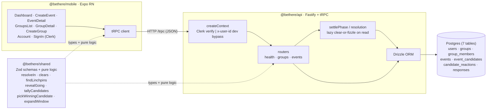

# Architecture

BeThere is a pnpm monorepo: an Expo React Native client talks to a Fastify + tRPC
API backed by Postgres, with a shared Zod/types package that wires the type chain
end-to-end.

The product is a **convergence model**. A creator floats one plan to a group, and the
only fork the user sees is how precisely they pin the time (`whenMode`):

- **exact** - a fixed time. Skips collecting, opens straight into a blind timed
  **moment**, and always happens ("it's on, who's in?").
- **options** - a short menu of fixed times. Members react ("works for me"); the
  best-supported slot wins.
- **fuzzy** - a loose window (a timescale + a part-of-day band) expanded server-side
  into day candidates that members react to.

Everything after the `when` is shared: a plan moves through phases
`collecting -> moment -> cleared` (or a silent `fizzled`), and members RSVP during the
moment with **yes / no / "I'll go if [people]"**. The dashboard groups each user's
plans by **Reacting / Awaiting / Going / Declined**.

## Components


```mermaid
flowchart LR
  subgraph mobile["@bethere/mobile · Expo RN"]
    UI["Dashboard · CreateEvent · EventDetail\nGroupsList · GroupDetail · CreateGroup\nAccount · SignIn (Clerk)"] --> C["tRPC client"]
  end
  subgraph api["@bethere/api · Fastify + tRPC"]
    AUTH["createContext\nClerk verify | x-user-id dev bypass"]
    R["routers\nhealth · groups · events"]
    SVC["settlePhase / resolution\nlazy clear-or-fizzle on read"]
    AUTH --> R
    R --> SVC --> D["Drizzle ORM"]
    R --> D
  end
  DB[("Postgres (7 tables)\nusers · groups · group_members\nevents · event_candidates\ncandidate_reactions · responses")]
  S["@bethere/shared\nZod schemas + pure logic\nresolveIn · clears · findLinchpins\nrevealGoing · tallyCandidates\npickWinningCandidate · expandWindow"]

  C -- "HTTP /trpc (JSON)" --> AUTH
  D --> DB
  S -. "types + pure logic" .-> C
  S -. "types + pure logic" .-> R
```

Plain-text fallback:

```
[Expo RN: 8 screens] --tRPC/HTTP--> [Fastify + tRPC API] --Drizzle--> [Postgres: 7 tables]
          ^                                  ^
          |            @bethere/shared        |
          +--- Zod types + resolve/reveal ----+
```

## The lifecycle

```mermaid
sequenceDiagram
  participant U as User (mobile)
  participant A as API (tRPC)
  participant DB as Postgres
  U->>A: events.create { title, location, when, group }
  alt when = exact
    A->>DB: insert event (phase=moment, contingent=false), 1 candidate
    Note over A: opens straight into the blind moment; always clears
  else when = options | fuzzy
    A->>DB: insert event (phase=collecting, contingent=true) + candidates
    U->>A: events.react { worksCandidateIds }  (PRIVATE)
    A->>DB: replace caller's candidate_reactions
    Note over A: creator sees the tally; readyToLock once pickWinningCandidate finds a slot
    U->>A: events.lock { candidateId? }  (creator only)
    A->>DB: set chosenCandidate + moment window, phase=moment
  end
  U->>A: events.mine / events.get
  A-->>U: phase-aware view (blind during moment: no tally, no who-is-in)
  U->>A: events.respond { yes | no | conditional }
  A-->>U: { recorded }  (no running count)
  Note over A: settlePhase() on read once momentEndsAt passes (no scheduler):
  Note over A: resolveIn() >= quorum OR non-contingent -> cleared; else fizzled (silent)
  A->>DB: cleared -> status=resolved, reveal IN crowd · fizzled -> hidden
```

## Packages

| Package | Role |
|---|---|
| `@bethere/shared` | Single source of truth: Zod schemas (`WhenInput` discriminated union, `CreateEventInput`/`ReactInput`/`LockInput`/`RespondInput`, enums) + framework-free pure logic - `resolveIn`/`clears`/`findLinchpins` (conditional resolution), `revealGoing` (the blind-until-reveal gate), `tallyCandidates`/`pickWinningCandidate` (collecting), `expandWindow` (fuzzy -> day candidates). Unit-tested. |
| `@bethere/api` | Fastify + tRPC server; Clerk auth with a dev bypass (`createContext`); Drizzle/Postgres; `health`/`groups`/`events` routers; `settlePhase` resolves a moment lazily on read (no scheduler). Reseeds a replayable demo on boot. |
| `@bethere/mobile` | Expo RN; eight screens (Dashboard, CreateEvent, EventDetail, GroupsList, GroupDetail, CreateGroup, Account, SignIn) driving the typed tRPC client; Clerk sign-in with a dev fallback. |

## Type chain

Zod schema in `@bethere/shared` -> tRPC procedure in `@bethere/api` -> `AppRouter`
type -> typed client in `@bethere/mobile`. No hand-written API types. Mobile imports
`@bethere/api` **type-only**, so server code is never bundled by Metro. No `Date`
crosses the wire - procedures return ISO strings or epoch-ms numbers.

## Auth

Identity is server-authoritative in `createContext` (`apps/api/src/trpc.ts`). A verified
Clerk bearer token wins; when `CLERK_JWT_KEY` is unset and `DEV_AUTH_BYPASS=1` (local dev
and the M2 backend), it falls back to the spoofable `x-user-id` header (default `u_dev`).
`protectedProcedure` rejects unauthenticated callers; every other procedure is protected.
A first-seen real user is upserted into `users` so groups and RSVPs can reference them.
The open posture (dev bypass, open CORS, a global IP rate-limit as the only guard) is a
deliberate M2 shortcut - see `docs/tech-debt.md`.

## Privacy boundary (server-authoritative)

- **Reactions** during `collecting` are private: `events.react` records only the caller's
  taps; per-candidate counts are returned **only to the creator** (for the lock decision).
- During a blind **moment**, `events.get`/`events.mine` reflect only the caller's own
  answer - never the IN crowd, others' responses, or any running tally.
- `events.respond` returns `{ recorded }` - never the count (blind / equal).
- The IN crowd is revealed only once the moment ends or the plan is `cleared`
  (`revealGoing`); on a `fizzle` nothing is revealed and the plan is hidden from the
  dashboard entirely (a fizzle leaves no trace).

## Demo seeding

`reseedDemo()` runs on boot when `SEED_ON_BOOT=reset` (the local default: wipe + reseed a
clean demo each boot); `seedDemoIfEmpty()` runs for `if-empty` (the live backend, so a
redeploy never wipes real data); `off` skips it. The fixture is 11 users, 5 groups, and 7
plans chosen to cover every `(whenMode x phase)` the dashboard renders - options/collecting
(with `You` as creator, so the tally and "Lock it" show), fuzzy/collecting (awaiting your
reaction), exact/moment (a live blind countdown), cleared (Going and Declined), and a
fuzzy/fizzled plan (under quorum, so it must stay hidden).

## Deferred (wired later, behind these interfaces)

The linchpin nudge **delivery** (the pure `findLinchpins` already exists), push
notifications, real-time updates, AI seeding of suggestions, calendar integration, and a
scheduled (rather than lazy-on-read) moment resolver.

## Run it

```bash
pnpm install
pnpm db:up                            # Postgres on localhost:5433
pnpm --filter @bethere/api db:migrate
pnpm dev:api                          # http://localhost:3000 (reseeds demo on boot)
pnpm dev:mobile                       # Expo
```
