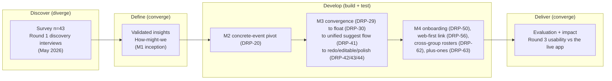
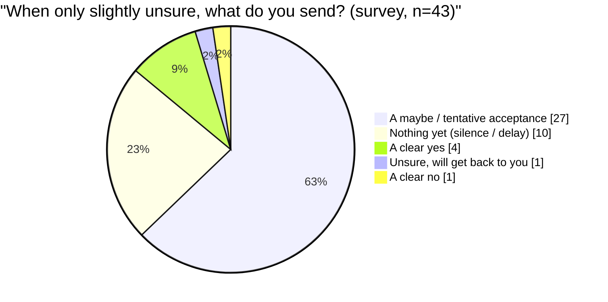
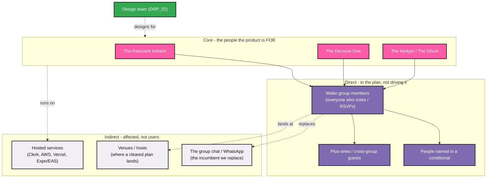
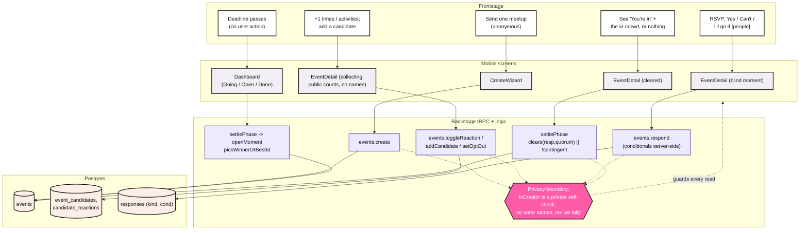
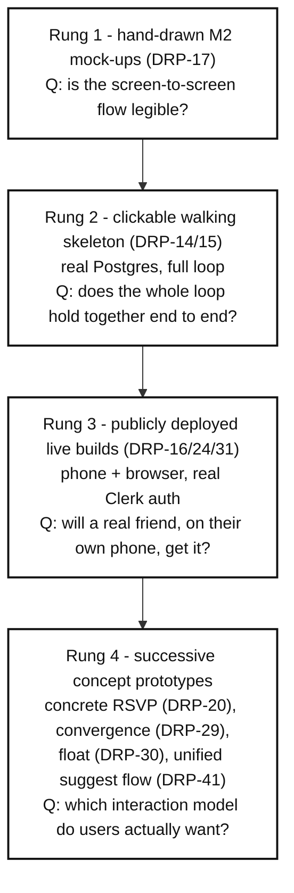
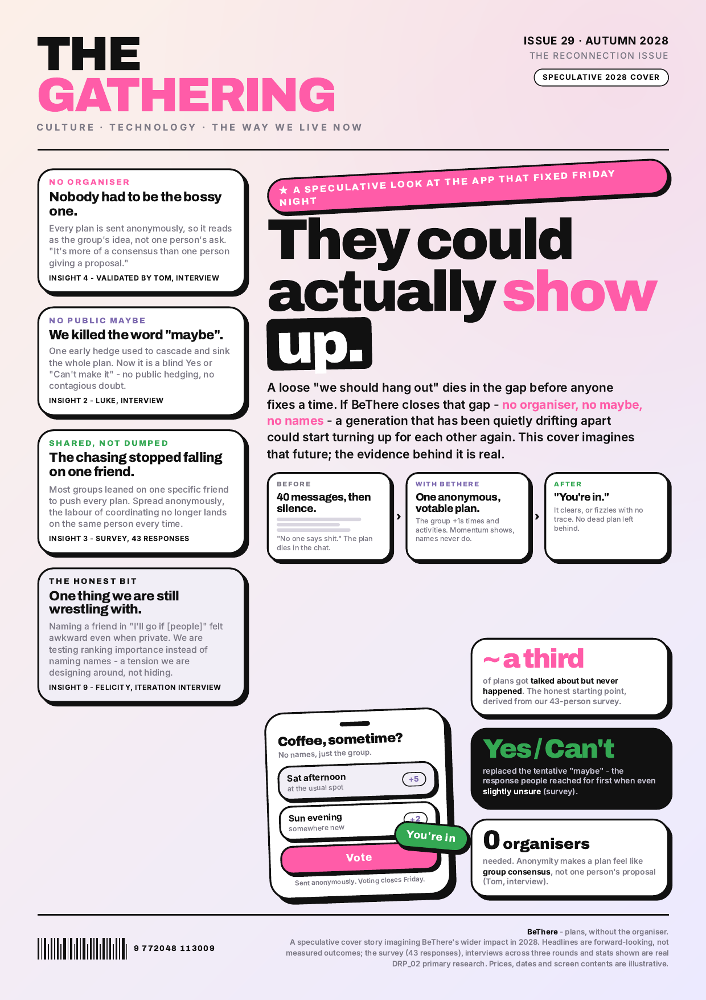

BeThere turns a vague "we should hang out" into a firm plan with no organiser and no public "maybe". A creator sends one plan to a group through a single, always-anonymous flow; the group +1s candidate times and activities (counts public, names never), then commits in a blind, deadlined moment whose only replies are Yes, Can't make it, or "I'll go if [people]". The group sees the meetup, never who proposed it.

This is a collation of the design artifacts behind that product, in the order the project ran: **the people, what we learned, what we built, and the impact**. Each part maps to one area of the portfolio assessment grid. The reflective commentary (how we found the process, what worked, what we would change) is held to about one A4 side, gathered in the five purple **Reflection** callouts; the rest of the document is evidence and design artifacts.

> How might we help a group of friends turn a loose intention to meet into a committed plan, **without anyone having to be the organiser** and **without the social pressure of a public "maybe"**?

> A note on evidence. Every quote, figure and DRP issue ID here is real primary research: a 43-response survey (collected 19-20 May 2026), interviews across three rounds, and the project's own Linear and git history. We did not run moderated, instrumented usability studies, so there is no System Usability Scale, task-success, time-on-task or telemetry data. Where such a figure belongs it is marked for the team to complete rather than invented.

## 1. Process, methods and research plan

We worked the Double Diamond across the term, pairing each phase to a course milestone. The build itself was the research probe: from M3 on, participants drove a deployed product on their own phone or browser.

### 1.1 Methods, and why each one

| Method | Scale | When | Why this method |
|---|---|---|---|
| Friend Meetup Dynamics Survey | 43 respondents | 19-20 May 2026 | A survey tells you how widespread a behaviour is: whether plans dying is common, and what people do when unsure, before committing to a build. |
| Round 1 discovery interviews | 4 (Luca, Luke, Matthew, Noah's friend) | Pre-build | A survey cannot tell you why someone sends a "maybe". Semi-structured interviews surfaced the felt mechanism behind the numbers. |
| Round 2 iteration usability | Tom, Felicity, Nathan, Fiza (think-aloud on the live M3 build) | M3 | Reacting to a working artefact, not a description, is where the sharpest findings came (anonymity validated, the conditional challenged). |
| Round 3 M4 usability | Luca (return), Nathan, Zack Foreman, Will Groves, Fangyi Lin, Thomas Gonzalez | M4 | Testing onboarding, web-link joining and plus-ones on the real funnel, with people who had not seen the app. R3 feedback was captured in think-aloud sessions and curated on the research board. |

### 1.2 Testing plan canvas

The plan we set at the start and reused each round: state the riskiest open assumption, set context without leading, watch a real person meet a real artefact.

| Round | What we wanted to learn (riskiest assumption) | Who + method | How we set the context | What counted as a signal |
|---|---|---|---|---|
| R0 Survey | Do plans die in the gap before a fixed time, and is the maybe/silence the mechanism (not day-of flaking)? | 43 respondents, self-completion | Neutral framing about "making plans with friends", no mention of our idea | A majority report plans dying; the dominant unsure reply is maybe/silence; appetite for a private signal |
| R1 Discovery | Why does the maybe cascade, and who carries the effort? | 4, semi-structured interview | "Sound as much as possible not like a complete CS student"; no technical words | Causal stories that explain the survey numbers |
| R2 Iteration | Does the built flow remove the organiser and the public maybe without new friction? | 4, think-aloud on the live app | "Talk about everything you're thinking as you go through"; hand them the phone, do not narrate | Unprompted comprehension; endorsement of anonymity; disconfirming evidence |
| R3 M4 usability | Will strangers onboard via a link, and are plus-ones safe? | 5, think-aloud on the live web funnel | Share only a link, as a real invite would arrive; no install instructions | A link converts to a joined, responding member; plus-ones do not surprise the group |

> Reflection. Prototype-led research was the single most useful technique: as Lukas put it on the design board, "if we start with an implementation in code then we can use that to dig into people's brains; it worked well doing that with the mockups." Deploying each interaction model and watching people use it produced sharper findings than asking ever did. The hard part was staying non-leading; an earlier round was flagged for only interviewing computing students, which is why we coached each other to drop the jargon.

## 2. People - personas and stakeholders

*(Grid: People.)* Every persona is built from named participants who behaved the same way, anchored by a verbatim quote and the matching survey signal.

> Note for the team: give each persona a real stock photograph of a person of roughly the right age, not an AI-generated face. Insert a licensed stock image into each photo slot before submission.

### 2.1 The signal that defines who we design for

When people are only slightly unsure they can make a plan, what do they actually send back?

37 of 43 (86%) default to a maybe or to silence; only 5 send a clean answer. Three of our four personas are defined by how they avoid committing. The fourth, the Decisive One, is the minority the product wants to make ordinary. Leadership is asymmetric too: only 4 of 43 mostly lead; 13 watch one specific friend do it; 20 coordinate in a diffuse way that, in interviews, meant nobody owns it.

| Persona | Grounded in | Defining survey signal | What BeThere must change |
|---|---|---|---|
| The Reluctant Initiator | Luca, Felicity | 4/43 "mostly me"; 13/43 "one specific friend (not me)" | Make initiating cost nothing socially (anonymity) |
| The Hedger | Matthew, Luca | 27/43 send "a maybe" when unsure | Remove "maybe"; force yes / no / conditional |
| The Ghost | Noah's friend | 10/43 send nothing; 20/43 would use a private signal more | Make non-response safe and useful, not a dead end |
| The Decisive One | Tom, Luke | 4/43 "clear yes", 1/43 "clear no" (the rare clean responders) | Give the deadline and push that lets decisiveness win |

### 2.2 The personas

#### Luca - The Reluctant Initiator

`[Persona photo: real stock image of a ~20-year-old male student. Do not use an AI-generated face.]`

The friend who actually wants to see everyone, and resents being the only one willing to say so.

- Goals: see his friends regularly; get a loose idea to actually happen; not feel like he is dragging people somewhere.
- Frustrations: usually the only one who organises; proposing feels like sticking his neck out; the group's silent default is "it won't work out".
- Needs from BeThere: to float an idea without it being his idea. Anonymity turns "Luca is making us commit again" into "the group is converging".

> "It's almost more a lack of suggestion than the lack of execution." (Luca, R1)
>
> "So I'm normally the only one who actually wants to do it." (Luca, R1)

#### Matthew - The Hedger

`[Persona photo: real stock image of a ~20-year-old student. Do not use an AI-generated face.]`

Keeps the time "semi-free" and reserves the right to ditch for something better.

- Goals: keep options open; avoid over-committing; protect a polite exit.
- Frustrations: open-ended plans drift and rot; "second thoughts" grow the longer a plan sits; he forgets plans that never reach a calendar.
- Needs from BeThere: no "maybe" button to hide behind, and a deadline so the plan cannot drift into doubt.

> "Maybe means I will keep the time semi-free, but if anything else comes up during that time that I feel like I would enjoy myself more, then I will [ditch]." (Matthew, R1)
>
> "I think too long can also be detrimental to the success of my plan." (Matthew, R1)

#### The Ghost (Noah's friend)

`[Persona photo: real stock image of a ~20-year-old student. Do not use an AI-generated face.]`

Reads the message, says nothing, and waits for someone else to commit first.

- Goals: still wants to meet (struggles even once a week); just will not move first.
- Frustrations: non-response is the failure; he waits for someone else to commit before replying.
- Needs from BeThere: a low-cost, private way to signal interest that only surfaces if it matches others, so silence stops being a dead end.

> "It's just people, ignore the message." (Noah's friend, R1)

20 of 43 said they would use a private "I'd be up for something this week" signal more than messaging the group directly (14 the same). For the Ghost, BeThere reframes non-response into a safe, private +1: you vote quietly, names are never shown, the plan fires only if enough others matched you.

#### Tom - The Decisive One (the minority we want to make normal)

`[Persona photo: real stock image of a ~20-year-old student. Do not use an AI-generated face.]`

Says yes or no cleanly, and wants the system to make everyone else do the same.

- Goals: a clear decision, fast; commit and move on.
- Frustrations: the group will not give a straight answer; without onboarding he was confused ("what is a group?").
- Needs from BeThere: a deadline with a real push, plus the anonymity that makes everyone else willing to answer.

> "The organisers should have an option to be anonymous... people are always really self-conscious of being the one to push things... by being able to make it anonymous there's no pressure on that person at all." (Tom, R2) - the single strongest validation of the anonymity model.
>
> "I'm down if others are down." (Luke, R1) - the conditional that became "I'll go if [people]".

> A persona-level tension we keep honest. Felicity surfaced a real conflict no persona should hide: "If you guys are making me put something in which says I'm only going if Jess goes, I can't do that. I wouldn't be able to say it out loud. Regardless of how private it is... I would feel so awkward actually writing down which of my friends I wanted to see." (Felicity, R2) Tom liked naming specific people. We carried this split forward (Section 6) rather than designing it away.

### 2.3 Stakeholder map

BeThere competes with the WhatsApp thread and depends on hosted services. Stakeholders sit in rings by how directly the product touches them.

| Ring | Stakeholder | Their need | Evidence |
|---|---|---|---|
| Core | The Reluctant Initiator | Move a plan without bearing the social cost of being the pusher | 4/43 lead; Luca, Felicity |
| Core | The Decisive One | A deadline and push so a clean yes/no closes a plan | Tom, Luke; 4/43 "clear yes" |
| Core | The Hedger / The Ghost | No "maybe" to hide in; a private signal so silence is not a dead end | 27/43 maybe, 10/43 silence; 20/43 private-signal |
| Direct | Wider group members | A safe way to show interest without the maybe-cascade; public momentum without exposed names | 27/43 maybe; Luke's cascade insight |
| Direct | People named in a conditional | Not to be put in an awkward position | Felicity's "I would feel so awkward" tension |
| Direct | Plus-ones / cross-group guests | Join a one-off meetup without joining a permanent group, and not surprise it | Luca, Zack Foreman, Nathan, Thomas Gonzalez (R3) |
| Indirect | The group chat / WhatsApp | The incumbent we must beat on convenience, or users stay put | Felicity: "Why would you bother going here if you're on WhatsApp anyway?" |
| Indirect | Venues / hosts | A firm time, headcount and place when a plan clears | location/notes fields feed this |
| Indirect | Hosted services | Contractual and data-processing dependencies | See the copyright/legal report |

> Reflection. The hardest stakeholder is the one we replace. Felicity's "it's foreign to download an app for this; a website would be less stressful" was a direct shot at adoption, and it is why the project later shipped a web target and a no-download share link (DRP-56). BeThere is not competing with "no tool"; it competes with the silent WhatsApp thread where, as Luke put it, when a plan dies "no one says shit".

## 3. Discover - current state, insights and the opportunity

*(Grid: Current/Future State - the current experience and the insights it generated.)*

### 3.1 Where the problem came from

The brief was not the first idea. The team explored a spontaneous-navigation app ("Stumble", a "Waze for walking") and a "prediction market for your friend group", dropped for a "gambling-punishment objection" and a "comfort-zone rubric penalty"; the brief converged on meetup coordination around 19 May. The seed mechanic appeared in Noah's discovery note: a friend whose meetups "fail for him about once a week... poor communication, people not saying whether or not they can make it", who "would wait until at least one other person gives their availability before he replies" - "if only there was a discrete way to say whether or not you can make it".

### 3.2 What the 43 survey responses say

Respondents are in the target group: most plan with 4-6 friends (25 of 43), the rest in twos and threes (13) or 7+ (4); one blank. Supporting patterns, all from the same 43 responses:

- Plans die often. 23 of 43 said 30% or more of recent hangouts got talked about but never happened; only 6 said under 10%.
- Bigger groups are worse. 36 of 43 (84%) said smaller groups make it easier; none said larger.
- The private signal is wanted. 20 of 43 would use a private "I'd be up for something this week" signal more than messaging the group; 14 the same; 4 less; 4 would not use it.
- The first time rarely sticks. Only 10 of 43 say the initial suggested time gets agreed often or always. This is why BeThere votes across candidate times rather than fixing one.
- Nobody wants to lead. 20 "evenly distributed", 13 "one specific friend (not me)", 5 "no one", 4 "mostly me"; 1 blank.
- The hedge is real. 24 of 43 admit having lied or made an excuse to skip a planned meetup; 19 never.
- Clashing schedules dominates (23 of 43 "Often"); disagreeing on location is rare (4 of 43), matching Luke: "99% of the time we get one place."

Bail reasons, in respondents' words: "Couldnt be arsed", "Too tired to go potentially because its too far", "Something else came up that I wanted to go to more than the meet up", "My failure to plan accordingly, eg I forgot." Low-stakes drift, the kind a blind, deadlined commitment is designed to hold together.

### 3.3 AEIOU of field research

| Lens | Observed | Evidence |
|---|---|---|
| Activities | Floating a vague "we should hang out"; informal poll and majority time even if someone can't make it; postponing when split; chasing non-responders; forgetting the meetup. | Nathan (poll/majority/postpone); Matthew, Luca (forgetting); survey (first time rarely agreed) |
| Environments | WhatsApp group chats; term-time dispersion and academic clashes; the drawn-out limbo of an unresolved thread where second thoughts grow. | Felicity ("if you're on WhatsApp anyway"); Matthew ("days went past... drawn out... doubts creeping in") |
| Interactions | The "maybe" as a deliberate hedge; silence and non-response; the conditional "I'm down if others are down"; cascading uncertainty where one early "I can't" writes off the plan. | Luca, Matthew (maybe); Luke ("cascades uncertainty... that is a website written off"); Felicity ("fear of being the only person who says yes") |
| Objects | Phones; WhatsApp chats and polls; Doodle-style polls; calendars people forget to fill; the BeReal-style push people respond to. | Felicity, Tom, Nathan (polls); Matthew (calendars); Luke, Tom (BeReal-style push) |
| Users | Small-to-mid friend groups of 4-6; a single reluctant or absent organiser; members who hedge to protect themselves; people who care more about seeing each other than the activity. | Survey (4-6 dominant; lead asymmetry); Felicity ("I just want to see them") |

### 3.4 Validated insights

Nine insights, each triangulated across the survey and interviews.

1. The bottleneck is suggestion and commitment, not execution. People who show up are fine; plans die before a time is fixed. (Luca; survey: first time rarely agreed.)
2. The "maybe" and silence are the failure mechanism, and uncertainty is contagious. (Luke: "cascades uncertainty... that is a website written off"; survey: 86% maybe or silence.)
3. Effort is asymmetric and nobody wants to be the organiser. (Felicity, Tom, Luca; survey: "one specific friend / not me".)
4. Anonymity removes the social cost of initiating; it makes a plan feel like consensus, not one person's ask. (Tom; survey: 20/43 would use a private signal more.)
5. People want to co-decide, not be organised. (Felicity: "you split the load across your friends... without feeling like you're dragging everyone".)
6. Often the company matters more than the activity. (Felicity: "I care less about what we do, I just want to see them.") So activity is optional and votable.
7. A blind, deadlined yes/no with a push beats an open-ended poll with a maybe. (Luke and Tom both reached for the BeReal-style "ding ding ding" prompt independently.)
8. Concrete and open plans are both needed; one switch should cover both. (Tom: "a checkbox or a switch... this is a concrete event you cannot change it... like a football match" - which became the lock flags.)
9. Honesty caveat: naming a friend in a conditional felt awkward even when private. (Felicity.) A genuine tension we surfaced and acted on.

### 3.5 The opportunity statement

> How might we help a group of friends turn a loose intention to meet into a committed plan, **without anyone having to be the organiser** and **without the social pressure of a public "maybe"**?

In one line: BeThere turns a vague "we should hang out" into a firm plan with no organiser and no public "maybe" - and the research above is why every one of those words is load-bearing.

## 4. Future state - journey maps and service blueprint

*(Grid: Current/Future State - the preferred future experience.)* The plan does not die from a logistics failure; it dies from a feelings failure, so the journeys track emotion as the primary signal.

### 4.1 Current state - "we should hang out" dies in a dead chat

Grounded in Matthew's bus-reunion ("days went past... it just got more drawn out... social thoughts ended up creeping in and more and more people ended up pulling out") and Luke's cascade ("when someone expresses some kind of uncertainty, it cascades uncertainty on the group... that is a website written off").

| Stage | What happens | Emotion | Pain |
|---|---|---|---|
| 1. The spark | "We should do something soon!!" | Hopeful | A spark is not a plan: no time, no place, no commitment. |
| 2. The hedge | A few "maybe!", one "what day though?", two go silent. | Guarded | The public maybe is a hedge, not an answer. |
| 3. The cascade | The first "ah I can't this week" lands; replies thin out. | Deflated | One early hesitation writes off the plan (Luke). |
| 4. The drag | Days pass; nobody re-raises it; everyone waits. | Apathy | Effort is asymmetric and nobody wants to lead. |
| 5. The doubt creep | Second thoughts settle; easy excuses surface. | Relief-tinged regret | The delay manufactures the decline (Matthew). |
| 6. The silent death | No message ends it; the thread just stops. | Quiet disappointment | The plan fizzles in a dead chat. |

### 4.2 Future state - the same friends, on BeThere

| Stage | What happens | Emotion | Insight applied |
|---|---|---|---|
| 1. Send (anonymous) | One person sends one meetup: candidate times, optional activities, a "Decides by" deadline. Sent anonymously. | Relieved, low-stakes | Insight 4: anonymity removes the cost of initiating. |
| 2. Collect and vote | Members +1 times and activities; anyone can add a candidate unless a lock is set. Counts show, names never do. | Engaged, safe | Insight 5: people co-decide; the load is split. |
| 3. Momentum, not maybe | Votes accumulate. There is no "maybe" button, only a +1 or no vote. | Encouraged | Insight 2 inverted: a quiet member adds no negative drag. |
| 4. Auto-lock at the deadline | Top time wins automatically; top activity becomes the plan's name if none was set. | Smooth, fair | Insight 3 + 7: no one calls it; a deadline beats an open poll. |
| 5. The blind moment | A timed moment opens; each person privately RSVPs Yes / Can't make it / "I'll go if [people]". A push nudges replies. | Decisive, a little urgent | Insight 7 + 8: no live tally, nothing to hedge against. |
| 6a. It clears | If enough are in, it clears: "You and 4 others are in." The in-crowd is revealed only now. | Confident | Commitment is revealed only after it is safe. |
| 6b. It fizzles | If not, it fizzles silently: no failure notice, hidden from every dashboard, no trace. | Neutral, no sting | Insight 9 / pain solved: failure leaves no dead thread, no blame. |

### 4.3 Service blueprint - frontstage to database

The future journey mapped onto the real system: frontstage actions, the mobile screens, the backstage tRPC procedures, and the Postgres data (names from `apps/api/src/routers/events.ts` and `db/schema.ts`). There is no scheduler: phase transitions settle lazily on every read/write (`settlePhase` / `openMoment`), so a plan auto-locks and clears/fizzles the next time anyone touches it, keeping the privacy boundary inside the server.

Three privacy promises are structural, not copy. **Anonymous creator:** `isAnonymous` defaults true and the read layer returns `isCreator` only as a private boolean, never the creator's id. **No live tally:** during collecting the API returns per-candidate +1 totals but never the voter set; during the moment it returns nothing about others. **Silent fizzle:** a plan that misses quorum flips to `fizzled` on the next read and drops out of every dashboard, with no push and no dead thread.

> Reflection. Mapping the journey by emotion rather than logistics was the choice that reframed the whole project: the before-curve only ever falls, and the future-state's job is not to add features but to stop the fall. That is why the most important design decisions (anonymity, no maybe, silent fizzle) live in the server's procedures, not just in the words on the screen.

## 5. Prototyping - the fidelity ladder and build evolution

*(Grid: Testing and Validation - visual evolution of the touchpoint, concept to feature to experience.)* Prototyping was a deliberate fidelity ladder, raised only when a real question demanded it.

We climbed each rung because the one below ran out of answers: paper could show the journey made sense but not whether the interaction model was right; the walking skeleton gave behaviour but we drove it ourselves; public live builds let a friend use the actual product on their own device, which made the iteration interviews genuine usability tests. The authentic Rung 1 artefacts are the hand-drawn M2 mock-ups in `docs/mockups/m2/ALL_MOCKUPS.pdf`: the create screen (which became `CreateWizard`) and the "I will make it if..." moment sheet with friends and tick boxes (the direct ancestor of the `events.respond` conditional).

> `[TEAM TO FILL: built-app screenshots.]` Capture three screens from the live app - the create wizard, the collecting EventDetail with public vote counts (no names), and a cleared "You're in" moment - and place them beside the hand-drawn sketches to complete the concept-to-experience ladder. They show the refined-neobrutalist visual system shipped in DRP-25.

## 6. Testing, iteration and analysis

*(Grid: Testing and Validation - feedback leading to a richer experience, and reflection on what drove each change.)* Each round tested the riskiest open assumption at that point (see the testing plan canvas, Section 1.2).

### 6.1 Finding-to-change traceability matrix

The heart of the section: every finding is real survey data or a real interview quote; every change is a real DRP issue with a verified status.

| Finding (source) | Insight | Change shipped (DRP issue) |
|---|---|---|
| 27/43 send "a maybe", 10/43 silence when slightly unsure; only 5 a clean answer (survey). | Hedging is the default and the failure mechanism. | The moment is a blind, deadlined RSVP - Yes / Can't make it / "I'll go if [people]" - with no public maybe and no running tally (DRP-29, unified in DRP-41). |
| "When someone expresses uncertainty it cascades... that is a website written off" (Luke). | One early hedge collapses group certainty. | Votes and RSVPs are server-authoritative and blind during the moment; a fizzle is silent and hidden (DRP-29, DRP-41). |
| "The organisers should have an option to be anonymous... no pressure on that person at all... more of a consensus than one person giving a proposal" (Tom); only 4/43 lead. | Anonymity reframes a plan as group consensus. | Creator anonymity is always on - the group sees the meetup, never who proposed it. No toggle; it is the only mode (DRP-41). |
| "You split the load across your friends... suggest things without feeling like you're dragging everyone" (Felicity); 36/43 say bigger groups are harder. | People want to co-decide, not be organised. | Two public, member-fed candidate lists, TIME and ACTIVITY, that any member can add to and +1; counts public, names never (DRP-30, DRP-41). |
| "I care less about what we do, I just want to see them" (Felicity); activity rarely the barrier (4/43) vs clashing schedules (23/43). | Company often matters more than the activity. | The activity is optional; the most-voted activity becomes the plan's name only if none was set (DRP-41, DRP-42). |
| "A checkbox or a switch... this is a concrete event you cannot change it... like a football match" (Tom); confusion over the three suggest modes. | One switch should cover concrete and open, not three modes. | `lockTimes` / `lockActivity` flags (both default open); a fully pinned plan skips collecting straight to a blind moment. The three-mode fork was deleted (DRP-41). |
| "The deadline would be better... but only if there was a push... like BeReal, it goes off, ding ding ding" (Tom); Luke described the same. | A blind, deadlined, push-driven yes/no beats an open poll. | Lock-in deadline plus device-local "Voting closes" / "RSVP closes" reminders (DRP-32, folded into DRP-41). |
| The countdown bar turned greener as the deadline approached, signalling "you're nearly there" exactly when urgency should rise (M3-review usability feedback). | Urgency was being signalled backwards. | The green drain bar was replaced with a plain-language countdown ("Voting closes in 2 days"); urgency shown in pink under one hour (DRP-43). |
| "It's very hard to know what days you're actually talking about... I don't even know if it's a Monday" (Felicity); "relative from today... in two days time" (Tom). | The create flow lacked everyday time scaffolding. | Day-of-week in dates, half-hour-floored default deadlines, a drawn timeline of deadlines, and a calendar/relative picker (DRP-43, DRP-58, DRP-60, DRP-61). |
| "I have to put in a hard time" when you only want to float an idea (Felicity); "people are too nervous to submit an official thing" (Tom). | Loose, low-pressure suggesting must be a first-class path. | Open-by-default collecting: a plan can be sent with no lock, so the group decides time and activity collaboratively (DRP-30 float, generalised in DRP-41). |
| Luca could not tell which of three suggest modes to use for a loose, see-who's-free meetup; the create page felt cluttered to Zack Foreman ("especially with the boxes"). | Users think in intent, not time-precision; the form was too heavy. | The three-mode dial was deleted and the create flow became a single CreateWizard split into clear steps (DRP-41, DRP-43, DRP-44). |
| "Blind or raw suggesting it onto a group chat and hoping people download it is probably not it" (Fangyi Lin); "a website would be less stressful" (Felicity); "it's just a link... that feels much more seamless" (Luca, R3). | The download is the adoption barrier, not the idea. | Group onboarding via invite links and join codes (DRP-50) and a no-download meetup share link with a web preview that converts to a responding member (DRP-56). |
| "You might want to invite several groups... or a friend of a friend as a plus-one... but you don't want to invite them to the group" (Luca); the two-group birthday case (Zack Foreman). | Real meetups cross groups and bring guests. | Freely-composed rosters: attach another group or add ad-hoc individuals by link, without polluting "My Groups" (DRP-62). |
| "Adding plus-ones has to be a controlled thing" (Nathan, R3); the failure he described is finding a stranger at the meetup he did not know was coming. | Plus-ones need trust controls and visibility. | A "Who's invited" roster showing who brought whom ("via X's link"), a joins-lock door, and brought-by attribution (DRP-63). Validated: "Oh that was easy" (Thomas Gonzalez); "it shows who invited him - no one's getting surprised on the day" (Luca). |
| Felicity could not name friends on camera, even privately (R2). | Felt privacy is not the same as technical privacy. | The conditional "Go if [people]" copy was softened and defaulted to "At least one" rather than a named person (DRP-47). |

### 6.2 Three core interactions, shown evolving

1. **From three modes to two switches.** We built variable-precision time as a hidden branch (DRP-29), then exposed it as a Float / Rough / Set dial (DRP-30). It failed in front of Luca, who could not map his intent onto any of the three, and the jargon ("auto-tips", "spark", "brewing") compounded it. We deleted the dial and the entire three-mode model for one votable plan governed by two lock flags (DRP-41). A real user simplified our information model.
2. **Anonymity, from a nice-to-have to the spine.** Anonymity began as one option among many. Tom's unprompted argument hardened it into always-on, server-authoritative anonymity (DRP-41) - the single decision that answers the asymmetric-effort insight.
3. **The conditional RSVP, challenged and softened.** Built on a sound insight (Luke's "I'm down if others are down"), but Felicity rejected naming a friend even privately, so we softened the copy and defaulted to "At least one" instead of a named person (DRP-47). Her stronger alternative - rank importance instead of naming - remains logged as future work.

> Reflection. The finding-to-change matrix is the artefact that kept us honest: it forced every shipped change to point back at a real quote or survey number. Two findings matter most because they pushed back. Felicity's reaction to the conditional was the clearest disconfirming evidence we found - the privacy guarantee is real and server-resolved, but felt privacy and technical privacy are not the same thing, and we changed the default rather than averaging the tension away (DRP-47). And one iteration (the float/wizard work) was built before its interview; Lukas pushed back on the board - "we don't have user feedback requesting this feature... it needs a reason to be made" - and the team agreed a rule, "we've got to do interviews first". We mostly let evidence lead, but not always, and the discipline only held because someone insisted on it.

## 7. Impact

*(Grid: Understanding Impact - better outcomes for the target audience and for wider stakeholder groups.)* We frame impact modestly: a 43-response survey, three rounds of interviews, and a working build, but no longitudinal usage data. The claims below are the change the design is intended to produce, told through the personas and tied to evidence that the underlying problem is real.

**Direct impact, through the personas:**

- **Luca (Reluctant Initiator):** floats a plan without it being his ask. Anonymity (DRP-41) means no one to chase and no one to blame - the asymmetric-effort he lives with ("I'm normally the only one who actually wants to do it").
- **Matthew (Hedger):** no maybe to hide behind and no infinite runway. The deadline (DRP-32/41) closes the plan before his "second thoughts" can grow.
- **The Ghost (Noah's friend):** a quiet +1 is now a safe, useful signal, not a dead end. Names are never shown; the plan fires only if enough others matched him.
- **Tom (Decisive One):** the blind, deadlined moment with a push gives his clean yes/no a system that makes everyone else answer too.

**Wider impact (carefully bounded):** term time disperses groups, and the coordination cost of regrouping is the cost BeThere lowers. Matthew described a reunion that "got more drawn out... and more and more people ended up pulling out", and the survey shows the failure is common. If the tool helps groups clear that low-stakes hurdle, the downstream good is more in-person contact among young adults who otherwise drift apart. For the indirect stakeholders mapped in Section 2.3, the intended outcomes are lighter but real: venues and hosts get a firm time and a headcount the moment a plan clears, and the group chat is augmented rather than replaced - BeThere settles one decision and hands the group back to wherever they already talk. We do not over-claim: BeThere does not cure loneliness, and we have not measured wellbeing. The honest statement is narrower - it removes a specific, evidence-backed friction that causes low-stakes plans to die.

### 7.1 Impact asset - speculative cover story

The cover story imagines that future explicitly: a 2028 magazine cover, "They could actually show up", framing the headline outcomes (no organiser, no public maybe, shared labour) as forward-looking, not measured. Every stat on it is real DRP_02 primary research.

> Felicity's line is the human core of the intended impact: "I care less about what we do, I just want to see them."

## 8. Reflection - what HCD did to the product

> Reflection. The strongest evidence that we did human-centred design rather than feature-led design is that the product model itself changed in response to users, repeatedly. HCD **deleted** features (the three-mode fork, DRP-41), **promoted** a flag to a principle (always-on anonymity), and **left a real tension on the table** (naming people in conditionals) rather than pretending we resolved it. The product is smaller and sharper than the one we first imagined, and that narrowing is the clearest signal we were listening. What we would do differently: prioritise onboarding earlier so the iteration interviews tested the whole journey, not just the core loop (onboarding only landed in M4, DRP-50). The open work, framed by user needs not a feature wishlist: the felt-privacy problem in the conditional (test Felicity's "rank importance" alternative), reliable remote push (currently device-local, blocked on a dev build rather than Expo Go), and competing with the group chat people already live in (the web-first link, DRP-56, is the first move). We deliberately did not collect SUS, task-success or telemetry; the quantitative-evaluation report scopes those instruments, and we will not present an intended outcome as a measured one until they are run.

The project's own history is the best evidence of the process: a cancelled feature (DRP-40, scaling moment length by distance), a betting-market idea dropped before it began, three suggest modes collapsed into two flags, and a conditional softened after one participant could not face it - the marks of a design that kept changing because real people kept telling us to.
