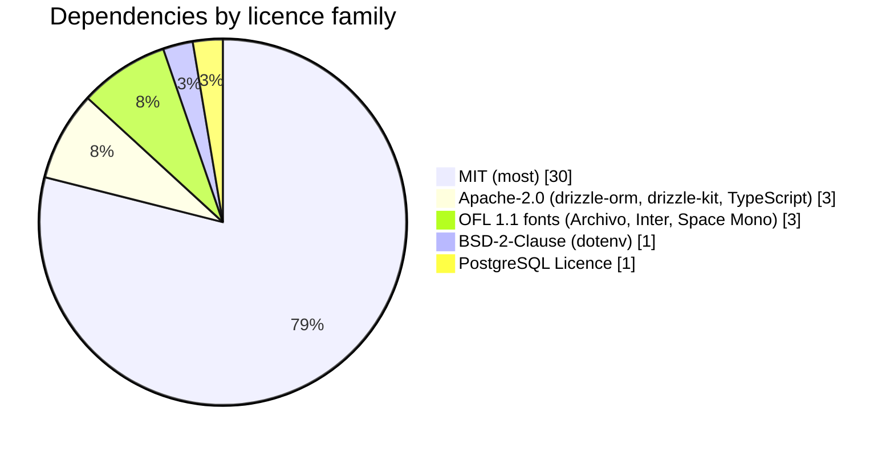

# BeThere - Copyright and Legal Issues Report

## 1. Scope

This report inventories every third-party resource bundled into or relied on by the BeThere touchpoint (Expo React Native mobile client plus Fastify/tRPC/Postgres backend) that the team did not write itself, links each one to its licence, and assesses the legal position were BeThere to be released officially. Versions were confirmed against the four workspace `package.json` files (root, `apps/api`, `apps/mobile`, `packages/shared`).

## 2. Headline finding (licence tally)

Across the runtime, build, and font dependencies, the licensing is permissive throughout: MIT (the large majority), Apache-2.0 (3: drizzle-orm, drizzle-kit, TypeScript), BSD-2-Clause (1: dotenv), the PostgreSQL Licence (1), and SIL OFL 1.1 (3 font families). There is **zero copyleft** (no GPL, AGPL, or LGPL anywhere), so there is no source-disclosure obligation. The only material non-open-source considerations are commercial (Clerk and the hosting providers) and regulatory (UK GDPR); see section 5.

## 3. Third-party resources

Where the Implication cell reads `*`, the obligation is the same: permissive licence, retain the notice in BeThere's in-app attribution screen. Rows that differ carry their own note.

### Runtime libraries (ship in the product)

| Package / resource | What it provides | Licence | Implication |
| --- | --- | --- | --- |
| react 19.1.0, react-dom 19.1.0 | UI runtime | MIT | * |
| react-native 0.81.5 | Native mobile runtime | MIT | * |
| react-native-web ^0.21.0 | RN-to-web rendering | MIT | * |
| expo ~54.0.35 and expo-* (auth-session ~7.0, clipboard ~8.0.8, font ~14.0, linear-gradient ~15.0, notifications ~0.32, secure-store ~15.0, status-bar ~3.0, web-browser ~15.0), @expo/metro-runtime ~6.1 | Expo SDK and native modules | MIT | * (hosted EAS build is a service, see section 5) |
| @react-navigation/native ^7.2, native-stack ^7.16, bottom-tabs ^7.16 | Navigation | MIT | * |
| @react-native-community/datetimepicker 8.4.4 | Native date/time picker | MIT | * |
| react-native-safe-area-context ~5.6, react-native-screens 4.16.0 | Layout / native screen primitives | MIT | * |
| @trpc/server ^11, @trpc/client ^11 | End-to-end typed RPC | MIT | * |
| fastify ^5.2, @fastify/cors ^10, @fastify/rate-limit ^10.3 | HTTP server plus middleware | MIT | * |
| zod ^3.24.1 | Schema validation (shared) | MIT | * |
| pg ^8.13.1 | Postgres client | MIT | * |
| pino ^10.3.1 | Structured logging | MIT | * |
| drizzle-orm ^0.38.3 | ORM / query builder | Apache-2.0 | Reproduce upstream NOTICE if shipped; carries patent grant. |
| dotenv ^17.4.2 | Env-var loading | BSD-2-Clause | * |
| @clerk/backend ^3.4.14, @clerk/clerk-expo ^2.19.31 | Auth SDKs (Google OAuth) | MIT (SDKs) | SDK code is MIT; the Clerk **service** is commercial, see section 5. |
| PostgreSQL (server, via Docker/RDS) | Database engine | PostgreSQL Licence (BSD-style permissive) | No disclosure duty. |

### Fonts (bundled assets)

| Package / resource | What it provides | Licence | Implication |
| --- | --- | --- | --- |
| @expo-google-fonts/archivo ^0.4, @expo-google-fonts/inter ^0.4, @expo-google-fonts/space-mono ^0.4 | npm wrappers | MIT | Wrapper code is MIT. |
| Archivo (Omnibus-Type), Inter (Rasmus Andersson), Space Mono (Colophon/Google) | The actual font files bundled by the above | SIL Open Font Licence 1.1 (OFL) | Retain OFL text and font copyright lines; see section 4. |

### Dev / build tooling (not shipped in the product)

These run only at build, test, or development time and are not redistributed, so they carry near-zero obligation.

| Package / resource | What it provides | Licence |
| --- | --- | --- |
| typescript ~6.0.3 (api/shared), ~5.9.3 (mobile) | Type system / compiler | Apache-2.0 |
| drizzle-kit ^0.30.1 | Migration generation | Apache-2.0 |
| @biomejs/biome 2.4.16 | Lint / format | MIT |
| tsx ^4.19.2 | TS execution / dev runner | MIT |
| jest ~29.7.0, jest-expo ~54.0.17, @testing-library/react-native ^13, react-test-renderer 19.1.0, vitest ^4.1.7 | Test runners / harness | MIT |
| @babel/core ^7.29.7 | Transpilation | MIT |
| concurrently ^9.1.0, pino-pretty ^13.1.3, pnpm 9.15.4 | Dev orchestration / log formatting / package manager | MIT |
| @types/node, @types/pg, @types/jest ^29.5.14, @types/react ~19.1.17 (DefinitelyTyped) | Type stubs | MIT |

### Hosted / commercial services (outside open-source licensing)

| Resource | What it provides | Licensing basis | Implication |
| --- | --- | --- | --- |
| Clerk | Auth-as-a-service (Google OAuth identities) | Commercial SaaS (paid tiers; SDKs MIT) | Governed by Clerk's terms and pricing, not a software licence; processes identity data, see section 5. |
| AWS App Runner plus RDS | API hosting plus managed Postgres | AWS Customer Agreement | Commercial contract; review terms and data residency. |
| Vercel | Web target hosting | Vercel terms | Commercial contract. |
| Expo / EAS | Android build service | Expo EAS terms | Commercial/freemium build service (the SDK itself is MIT). |
| GitHub Actions | CI/CD | GitHub terms | Commercial/free-tier CI. |
| Docker plus Postgres (local dev) | Local database | Permissive / Docker terms | Dev-only. |

## 4. Fonts - explicit note

The three `@expo-google-fonts/*` npm packages are MIT-licensed wrappers, but the font files they bundle are licensed under the **SIL Open Font Licence 1.1 (OFL)**: Archivo (Omnibus-Type), Inter (Rasmus Andersson), and Space Mono (Colophon/Google). In plain terms, the OFL is permissive and allows bundling and redistribution inside an application on two conditions: the OFL licence text and copyright notices are retained, and the fonts are not sold on their own as font files (selling an app that includes them is fine). BeThere should therefore keep the OFL notice and the font copyright lines in its attribution screen. Note that **Space Mono is still a listed dependency but is no longer rendered in the UI** (it was dropped from the visual system in DRP-43); the live touchpoint renders only **Archivo plus Inter**. The unused package can be removed to keep the bundle and attribution list tidy, though there is no licensing obligation to do so.

## 5. Legal discussion - if officially released

**No copyleft, so a commercial release is feasible.** Every dependency BeThere ships or builds with is permissive (see the tally in section 2). With no GPL, AGPL, or LGPL anywhere in the tree, there is no source-disclosure (copyleft) obligation and no "viral" relicensing risk, so BeThere could be released commercially, including as a closed-source product, without publishing its own source. The standing obligation is modest: preserve the licence notices and copyright text of the bundled components (a "Licences" attribution screen in the app, plus a NOTICE in any distribution, satisfies this), and retain the OFL attributions for the bundled fonts as described in section 4.

**Apache-2.0 specifics.** The Apache-2.0 components (drizzle-orm at runtime; TypeScript and drizzle-kit at build time) add two points beyond MIT: the licence carries an express patent grant (a benefit to BeThere), and where an upstream project ships a `NOTICE` file its contents must be reproduced in any redistribution. Only drizzle-orm is actually distributed in the product, so this duty is narrow; the build-time Apache tools are not redistributed and raise no obligation.

**Commercial and contractual dependencies sit outside open-source law.** The material non-open-source consideration is Clerk (a paid authentication service: the SDKs are MIT but the running service is governed by Clerk's commercial terms and pricing) together with the hosting providers (AWS App Runner plus RDS, Vercel, Expo/EAS build, GitHub Actions). These are contractual relationships, not software licences, and their terms of service, pricing, SLAs, and data-processing terms must be reviewed before an official launch; in particular Clerk and AWS act as data processors and would need data-processing agreements in place.

**Data protection (UK GDPR).** BeThere stores user identities (via Clerk/Google OAuth), group membership, and RSVP behaviour (who is going to what, plus conditional "I'll go if [person]" data). This is personal data, and some of it (records of who someone wants to socialise with) is behaviourally sensitive even if not a special category. An official release would therefore require a published privacy policy, an identified lawful basis for processing (consent or legitimate interests), data-subject rights including access and deletion (the model already supports silent fizzles and anonymity, which helps with data minimisation), a clear stance on data retention for cleared and fizzled plans, and confirmation of where data is hosted (the RDS region) for transfer purposes. The current M2/M3 posture (open CORS and a dev auth bypass, documented in `docs/tech-debt.md`) is acceptable for a course prototype but must be closed before any public release.

**Summary.** The open-source licensing position is clean and low-risk: permissive throughout, no copyleft, obligations limited to notice and font-attribution retention plus the small Apache NOTICE duty. The real pre-launch work is contractual (vendor terms for Clerk and the hosts) and regulatory (UK GDPR compliance for the identity, membership, and RSVP data BeThere holds). Where a specific upstream licence matters financially, the team should verify the exact text shipped in `node_modules` at release time rather than rely on this summary.

---

\* Permissive licence; retain the notice in BeThere's in-app attribution screen.
