# BeThere - Human Centred Design Techniques Portfolio

BeThere is a group meetup-coordination app (Expo React Native client, Fastify/tRPC/Postgres backend) that turns a vague "we should hang out" into a firm plan with no organiser and no public "maybe". A creator sends ONE plan to a group through a single, always-anonymous flow; the group votes on candidate times and activities, then commits in a blind, deadlined moment where the only answers are Yes, Can't make it, or "I'll go if [people]". The group sees the meetup, never who proposed it. This portfolio documents the human-centred design work behind that product, organised around one question:

> **How might we** help a group of friends turn a loose intention to meet into a committed plan, without anyone having to be the organiser and without the social pressure of a public "maybe"?

## 1. Overview and process

We worked the Double Diamond across the DRP term (Imperial + RCA "Designing for Real People", DRP_02), pairing each diamond phase to a course milestone. **Discover** opened wide: a 43-response survey (19 to 20 May 2026) and a first round of 4 discovery interviews surfaced the failure mechanism. **Define** converged on the validated insights and the "How might we" question (M1 inception). **Develop** built and re-tested in thin slices through M2 and M3, with the product genuinely changing shape in response to evidence rather than feature-piling. **Deliver** (M4) covers evaluation and impact, including a second round of interviews against the built app.

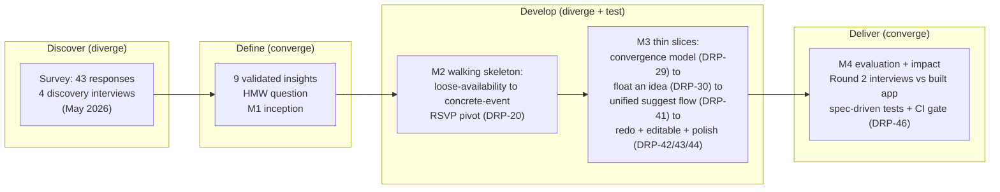

The key pivots all trace to evidence: the M2 move from a loose-availability prototype to a concrete-event RSVP app (DRP-20); the convergence model of "react to options, then a blind timed moment" (DRP-29); "float an idea" as anonymous open-ended suggesting (DRP-30); and their merger into ONE votable plan governed by two lock switches (DRP-41), with activity unification, the redo flow, and editable plans following (DRP-42/43/44).

**How to read this portfolio.** The sections that follow are: (2) People - personas and stakeholders; (3) Discover - field research, insights and the opportunity; (4) Define and Develop - journey maps and service blueprint; (5) prototyping techniques across the fidelity ladder; (6) testing, validation and evolution; and (7) understanding impact, the cover story and reflection.

---

## 2. People - personas and stakeholders

Every persona below is built from a real person in our primary research: the 43-response survey (collected 19 to 20 May 2026) and the 7 interviews across two rounds. No persona is invented. Each one is a composite of named participants who behaved the same way, anchored by a verbatim quote and by the matching survey signal. The point of the personas is to keep one truth in front of us at all times: **the plan does not die because people will not turn up; it dies in the silent gap before a time is ever fixed, and the gap is held open by the social cost of pushing and the social escape hatch of "maybe".**

### 2.1 How the research maps onto people

Before the cast, here is the single survey question that did the most to shape who we are designing for. When people are *only slightly unsure* they can make a plan, what do they actually send back?

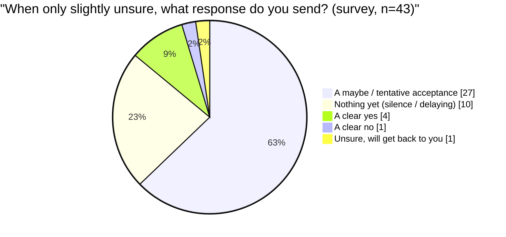

37 of 43 respondents (86%) default to a maybe or to silence; only 5 send a clean answer (4 a clear yes, 1 a clear no) (survey). That is the failure mechanism in one chart, and it is why three of our four personas are defined by how they avoid committing. The fourth, the Decisive One, is the minority the product wants to make ordinary.

A second question shaped who feels the *cost* of coordinating. Only 4 of 43 say they mostly lead; the rest watch one specific friend do it (13/43) or coordinate in a diffuse "evenly distributed" way that, in interviews, turned out to mean nobody quite owns it (20/43) (survey). Leadership is both asymmetric and reluctantly held, which is the seed of the Reluctant Initiator.

| Persona | Grounded in | Defining survey signal | The behaviour BeThere must change |
| --- | --- | --- | --- |
| The Reluctant Initiator | Luca, Felicity, Luke | Only 4/43 "mostly me"; 13/43 "one specific friend (not me)" | Make initiating cost nothing socially (anonymity) |
| The Hedger | Luca, Matthew | 27/43 send "a maybe" when unsure | Remove "maybe" as an option; force yes / no / conditional |
| The Ghost | Noah's friend | 10/43 send nothing; 20/43 "private signal more often" | Let non-response be safe and useful, not a dead end |
| The Decisive One | Luke, Tom | 4/43 "a clear yes", 1/43 "a clear no" (the rare clean responders) | Give the deadline and push that lets decisiveness win |

### 2.2 The personas

#### Persona 1 - Luca, "The Reluctant Initiator"

> One-line bio: the friend who actually wants to see everyone, and resents being the only one willing to say so.

- **Goals:** see his friends regularly; get a loose idea ("we should meet up") to actually happen; not feel like he is dragging people somewhere.
- **Frustrations:** he is usually the only one who organises (asymmetry); proposing feels like sticking his neck out; the group's silent default expectation is that "it won't work out". This is the lived version of the survey's leadership skew (only 4/43 lead; 13/43 watch one specific friend do it).
- **What he needs from BeThere:** to float an idea without it being *his* idea. Anonymity turns "Luca is making us commit again" into "the group is converging."
- **Grounding quotes:**
  > "It is almost more a lack of suggestion than the lack of execution." (Luca, round 1)
  >
  > "We have nobody who is really willing to push things... we will go, but someone else has to suggest it." (Felicity, iteration interview) - the same archetype seen in a different group.

Felicity sharpens this persona's core fear: "there is that fear of being the only person who kind of says yes." The Reluctant Initiator is not lazy; the act of *proposing* is the expensive part, and that is precisely what anonymity is designed to make free.

#### Persona 2 - Matthew, "The Hedger"

> One-line bio: keeps the time "semi-free" and reserves the right to ditch for something better.

- **Goals:** keep options open; avoid over-committing; protect a polite exit.
- **Frustrations:** open-ended plans drift and rot - "second thoughts" grow the longer a plan sits unresolved (Matthew); he does not reliably get plans into a calendar, so he forgets.
- **What he needs from BeThere:** no "maybe" button to hide behind. A blind moment with yes / can't make it / "I'll go if [people]" removes the hedge and the deadline removes the drift. Because the count is blind during the moment, his vote cannot quietly trigger the cascade.
- **Grounding quotes:**
  > "Maybe is a nice copout... a nice way for me to be like, please do not have too high expectations." (Luca, round 1)
  >
  > "I will keep the time semi-free, but if anything else comes up that I would enjoy more, I'll ditch." (Matthew, round 1)

The Hedger is the most common respondent in our data: 27 of 43 send a maybe when only slightly unsure (survey). Luca even admits the darker version - "sometimes I am a bit more malicious when I say maybe... I do not really intend to come" (Luca). Designing the maybe *out* of the interface is the most direct intervention the product makes against this persona's instinct.

#### Persona 3 - "The Ghost" (Noah's friend)

> One-line bio: reads the message, says nothing, and waits for someone else to commit first.

- **Goals:** still wants to meet (struggles to manage even once a week); just will not move first.
- **Frustrations:** non-response is the failure - "people ignore the message... they are not responsive" (Noah's friend); waits for someone else to commit before replying ("say nothing unless...").
- **What he needs from BeThere:** a low-cost, private way to signal interest that only surfaces if it matches others, so silence stops being a dead end. The survey strongly validates this need: 20 of 43 said they would use a private "I'd be up for something this week" signal **more** than messaging the group directly, with another 14 saying the same; only 8 were same-or-negative beyond that (4 "less often", 4 "wouldn't use it") (survey).
- **Grounding quote:**
  > "People ignore the message... they are not responsive." (Noah's friend, round 1)

The Ghost is why the survey's silence figure (10/43 send nothing when unsure) matters as much as the maybe figure. For this persona, BeThere reframes non-response from a plan-killer into a safe vote: you +1 quietly, names are never shown, and the plan only fires if enough others matched you.

#### Persona 4 - Tom, "The Decisive One" (the minority we want to make normal)

> One-line bio: says yes or no cleanly, and just wants the system to force everyone else to do the same.

- **Goals:** a clear decision, fast; the ability to commit and move on.
- **Frustrations:** the group will not give him a straight answer; he wants to be able to change his RSVP if life changes; without onboarding he was confused ("what is a group?", Tom).
- **What he needs from BeThere:** a deadline with a real push - "like BeReal, it goes off, ding ding ding" (Tom) - plus the anonymity that makes everyone else willing to answer.
- **Grounding quotes:**
  > "The organiser should have an option to be anonymous... nobody likes being the one that is making people commit... it is more of a consensus than one person giving a proposal." (Tom, iteration interview) - the single strongest validation of the anonymity model.
  >
  > "I am down if others are down." (Luke, round 1) - the conditional that became "I'll go if [people]".

The Decisive One is rare in our data: only 4/43 send a clear yes and 1/43 a clear no when unsure (survey). The product's ambition is to make the rest of the group behave like Tom by removing the two reasons they do not - the cost of pushing (solved by anonymity) and the temptation to hedge (solved by removing "maybe" and adding a deadline).

#### A persona-level tension we are keeping honest

Felicity surfaced a real conflict that no persona should hide. The "I'll go if [person]" conditional, even when private, felt socially impossible to her:

> "If you guys are making me put something in which says I am only going if Jess goes, I cannot do that. I would not be able to say it out loud. Regardless of how private it is... I would feel so awkward actually writing down which of my friends I wanted to see." (Felicity, iteration interview)

Tom, by contrast, *liked* naming specific people. This split (Felicity versus Tom) is a genuine, unresolved tension across our personas, and we carry it forward rather than design it away - Felicity's suggested alternative (rank importance rather than name names) is logged as an open question.

### 2.3 Stakeholder map

BeThere does not exist in a vacuum; it competes with a WhatsApp thread and depends on hosted services. The map below places stakeholders in concentric rings by how directly the product touches them. The personas above all live in the **core** and **direct** rings.

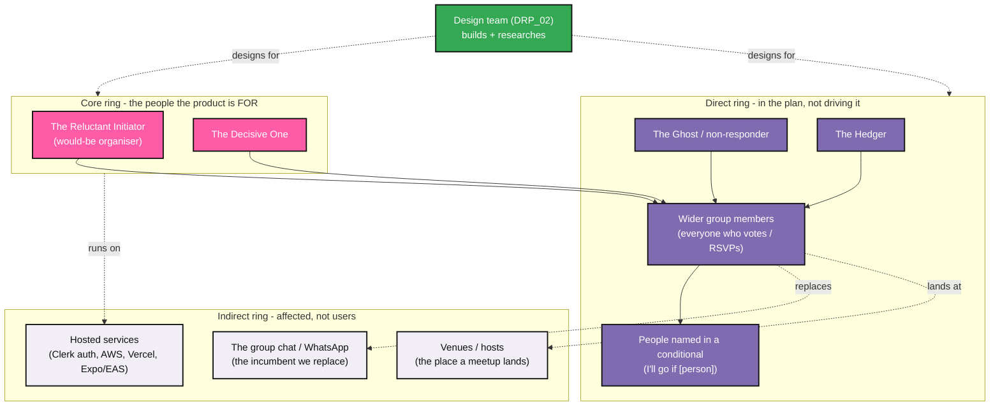

| Ring | Stakeholder | Their need | Evidence |
| --- | --- | --- | --- |
| **Core** | The Reluctant Initiator (would-be organiser) | To get a plan moving without bearing the social cost of being the pusher | Only 4/43 lead (survey); Luca, Felicity, Tom |
| **Core** | The Decisive One | A deadline and push so a clean yes/no actually closes a plan | Tom, Luke; 4/43 "clear yes" (survey) |
| **Direct** | Wider group members (voters / RSVPers) | A safe way to express interest without the maybe-cascade; public momentum without exposed names | 27/43 "maybe", 10/43 silence (survey); Luke's cascade insight |
| **Direct** | People named in a conditional | Not to be put in an awkward position by being named | Felicity's "I would feel so awkward" tension; Tom liked naming - unresolved split |
| **Direct** | The Hedger / The Ghost | Hedger: no "maybe" to hide in. Ghost: a private signal so silence is not a dead end | 27/43 maybe; 20/43 would use a private signal more (survey) |
| **Indirect** | The group chat / WhatsApp (incumbent) | The thing we must beat on convenience, or users stay put | "Why would you bother going here if you are on WhatsApp anyway?" (Felicity) |
| **Indirect** | Venues / hosts | Where a cleared plan physically lands (location/notes feed this) | Felicity: "that should probably be an actual location" |
| **Indirect** | Hosted services (Clerk, AWS, Vercel, Expo/EAS) | Contractual and uptime dependencies the product runs on | Stack (ARCHITECTURE.md); see copyright/legal report |
| **Cross-cutting** | Design team (DRP_02) | Validated insight to build the right thing, not feature-pile | Two HCD-labelled issues (DRP-9, DRP-25); thin-slice history (DRP-29 to DRP-44) |

The most important strategic stakeholder in the indirect ring is the **incumbent group chat**. Felicity's challenge - "it is foreign to download an app for this; I think a website would be less stressful" - is a direct shot at adoption, and it is why the project ships a web target on Vercel alongside the mobile app. BeThere is not competing with "no tool"; it is competing with the silent WhatsApp thread where, as Luke put it, when a plan dies "no one says shit."

---

## 3. Discover - field research, AEIOU, insights and the opportunity

> "It's almost more a lack of suggestion than the lack of execution." - Luca, discovery interview
>
> The people who turn up are fine. Plans die before a time is ever fixed. This section traces how we found that out, what the evidence says, and the single opportunity it points to.

### 3.1 Research methods - and why these ones

We deliberately combined a **quantitative survey** with **two rounds of interactive interviews** rather than relying on a static survey alone. A survey tells you *how widespread* a behaviour is; it cannot tell you *why* someone sends a "maybe", or watch their face when they read "I'll go if Jess goes". The interviews are the interactive HCD techniques: discovery conversations to understand the lived problem, then contextual demo / usability interviews where participants drove the actual build and reacted to it in real time.

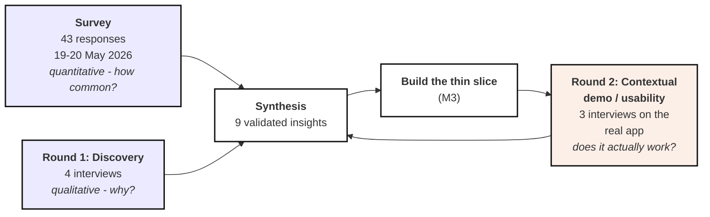

| Method | Scale | When | What it gave us |
|---|---|---|---|
| **Friend Meetup Dynamics Survey** | 43 respondents | 19-20 May 2026 | Prevalence of failed plans, the dominant "unsure" response, who leads, group-size effect, flaking culture |
| **Discovery interviews** (Round 1) | 4 people (Luca, Luke, Matthew, Noah's friend) | Pre-build | The *mechanism* of failure: the "maybe" as a copout, cascading uncertainty, asymmetric organiser effort |
| **Contextual demo / usability interviews** (Round 2) | 3 people (Felicity, Luca, Tom) | On the built app (M3 thin-slice validation) | Live reaction to features: anonymity validated, the conditional challenged, missing day-of-week / location / duration |

This is not a one-shot study. Round 2 fed back into synthesis, and the build itself was the probe - participants reacted to a working artefact, which is where the sharpest findings came from (the anonymity validation from Tom, the awkwardness of naming friends from Felicity).

### 3.2 What the 43 survey responses say

The survey was answered by people in the exact target group: **most plan with 4 to 6 friends** (25 of 43), the rest in twos and threes (13) or 7+ (4). The failure is common, not rare - and the *response to uncertainty* is the headline.

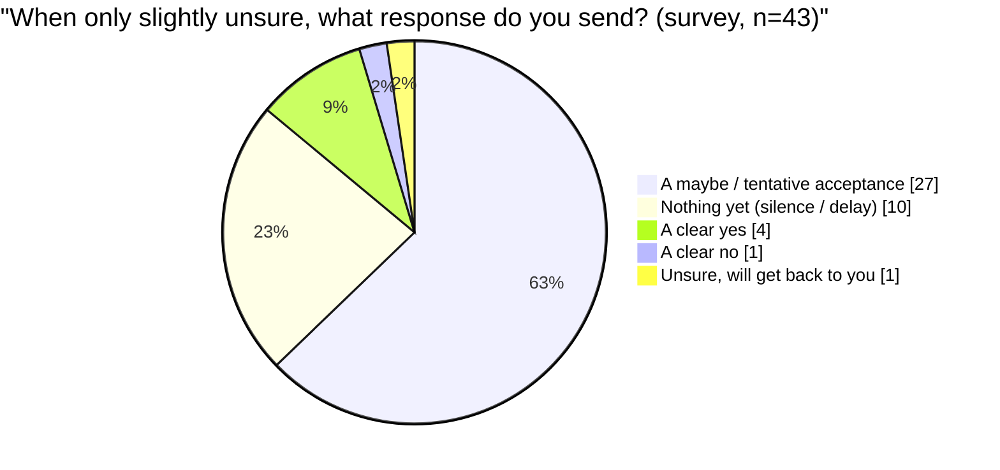

**Thirty-seven of 43 respondents (86%) default to either a "maybe" or silence** when slightly unsure. Only 4 send a clear yes and just 1 a clear no - 5 clean answers in total. This is the core quantitative finding: the natural reaction to mild uncertainty is to hedge or go quiet, never to commit or decline cleanly.

Supporting patterns from the same 43 responses:

- **Plans die often.** Asked what proportion of hangouts got talked about but never happened in the last 3 months, responses spread across every bucket, with a large share in the 30 to 100% range. Failure is normal.
- **Bigger groups are worse.** **36 of 43 (84%)** said "No, smaller groups make it easier"; the rest said size does not matter, and none said larger is easier. This directly validates a tool aimed at the harder, mid-sized group.
- **The private signal is wanted.** Asked whether they would privately signal "I'd be up for something this week" (invisible unless matched), the most common answer was **"More often than messaging the group directly" (20 of 43)**, with 14 saying "the same"; only 4 said they would not use it (and 4 said "less often"). This validates the anonymous / private signal at the heart of BeThere.
- **The first time rarely sticks.** "How often does the initial suggested date/time get agreed without change?" was dominated by "Rarely" (29 of 43) and "About half the time" (10) - which is exactly why BeThere votes across multiple candidate times rather than fixing one.
- **Nobody wants to lead.** "Who takes the lead?" skewed to "evenly distributed among a few" (20 of 43) and "mostly one specific friend, not me" (13); only 4 said "mostly me". Effort is asymmetric and the role is unpopular.
- **Flaking is admitted.** **24 of 43 (21 occasionally + 3 often)** answered "Yes" to ever lying or making an excuse to skip a planned meetup, against 19 "never". A small majority admits the hedge is not hypothetical.

Bail reasons, in their own words (verbatim, used sparingly): *"Couldnt be arsed"*, *"cba"*, *"Too tired to go potentially because its too far"*, *"Something else came up that I wanted to go to more than the meet up"*, *"My failure to plan accordingly, eg I forgot."*, *"Lack of social battery, mental health"*. These show the bail is usually low-stakes drift, not crisis - the kind a blind, deadlined, low-pressure commitment is designed to hold together.

### 3.3 AEIOU framework

We mapped the field data through **AEIOU** (Activities, Environments, Interactions, Objects, Users) so the design space is grounded entirely in what people told us, not in assumption. Every cell below cites its evidence.

| Lens | What we observed (all from research) | Evidence |
|---|---|---|
| **Activities** | Ad-hoc planning in a group chat; floating a vague "we should hang out"; running an informal poll and **taking the majority time even if someone can't make it**; postponing when it's split and everyone is needed; chasing non-responders (or not); forgetting the meetup entirely. | Luca R2 (majority-time / postpone / chase); Luke (overlap-spotting); Luca, Matthew (forgetting); survey (first time "rarely" agreed) |
| **Environments** | WhatsApp group chats as the default venue; university **term-time dispersion** and academic clashes (labs, tutorials); the long, drawn-out limbo of an unresolved thread where "second thoughts" grow. | Felicity ("if you're on WhatsApp anyway"); Matthew, Luke ("deadlocked" schedules); Matthew ("days went past... drawn out... doubts creeping in") |
| **Interactions** | **The "maybe"** as a deliberate hedge / copout; **silence and non-response**; the conditional **"I'm down if others are down"**; **cascading uncertainty** where one early "I can't" writes off the whole plan; reluctance to be the first to say yes. | Luca, Matthew ("maybe = copout / keep it semi-free"); survey (maybe + silence dominant); Luke ("I'm down if others are"; "cascades uncertainty... that is a website written off"); Felicity ("fear of being the only person who says yes") |
| **Objects** | Phones; **WhatsApp** chats and polls; **Doodle**-style polls; calendars people forget to fill; the push notification (the BeReal-style "ding ding ding" people respond to). | Felicity, Tom (WhatsApp / existing tools); Matthew (calendars not filled); Luke, Tom (BeReal-style push) |
| **Users** | Small-to-mid **friend groups of 4 to 6**; a single reluctant or absent organiser ("mostly one specific friend, not me"); members who hedge to protect themselves; people who care more about *seeing each other* than about the activity. | Survey (4-6 dominant; group-size; lead asymmetry); Felicity ("nobody willing to push"; "I just want to see them"); Luca (usually the only organiser) |

### 3.4 Current state vs preferred future state

The research describes a self-reinforcing failure loop. The design target is to break it at the two weakest links - the public "maybe" and the lone organiser.

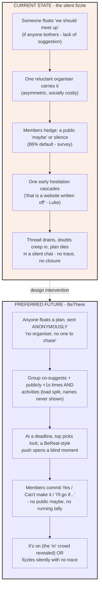

| Dimension | Current state (group chat) | Preferred future state (BeThere) |
|---|---|---|
| Who starts it | One reluctant, identifiable organiser | Anyone, sent anonymously - feels like consensus, not one person's ask (Tom) |
| Response to uncertainty | Public "maybe" or silence (86% - survey) | Private Yes / Can't make it / conditional; no public maybe |
| Effect of one hesitation | Cascades, plan dies (Luke) | No running tally, no visible doubt to catch on (server-authoritative privacy) |
| The time | First suggestion rarely sticks (survey) | Vote across multiple candidate times; top pick wins |
| The activity | One person "drags everyone" somewhere | Co-suggested and voted; optional, because "I just want to see them" (Felicity) |
| Failure | Drawn-out, awkward, doubt-breeding | Deadlined; clears or fizzles silently with no trace |

### 3.5 Validated insights

Nine insights, each triangulated across the survey and interviews. These are the load-bearing findings the rest of the design rests on.

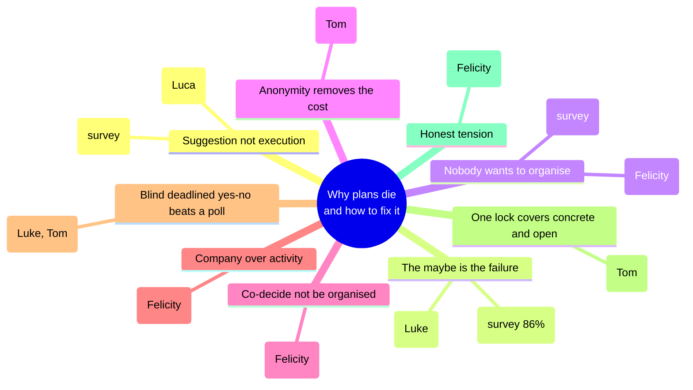

1. **The bottleneck is suggestion and commitment, not execution.** People who show up are fine; plans die before a time is ever fixed. *(Luca: "lack of suggestion than the lack of execution"; survey: first time "rarely" agreed without change.)*
2. **The "maybe" and silence are the failure mechanism.** Uncertainty is socially contagious - one early hedge cascades and the plan dies in a silent chat. *(Luke: "cascades uncertainty... that is a website written off"; survey: 86% default to maybe or silence.)*
3. **Effort is asymmetric and nobody wants to be the organiser.** Being the one to push, chase and make people commit is socially costly. *(Felicity, Luca, Tom; survey: "one specific friend / not me".)*
4. **Anonymity removes the social cost of initiating** - it makes a plan feel like group consensus, not one person's ask. *(Tom: "the organiser should have an option to be anonymous... no pressure on that person at all... more of a consensus than one person giving a proposal"; survey: 20 of 43 would use a private signal more.)*
5. **People want to co-decide, not be organised.** Collaboratively suggesting times *and* activities spreads the load and removes the pressure of "dragging everyone" somewhere. *(Felicity: "you split the load across your friends... without feeling like you're dragging everyone".)*
6. **Often the activity matters less than the company.** *(Felicity: "I care less about what we do... I just want to see them.")* So activity is optional and votable, not mandatory.
7. **A blind, deadlined yes/no commitment with a push beats an open-ended poll with a maybe.** *(Luke and Tom both reached independently for the BeReal-style "ding ding ding" timed prompt.)*
8. **Concrete and open plans are both needed; one switch should cover both.** *(Tom: "a checkbox or a switch... this is a concrete event, you cannot change it... like a football match" - which became the lockTimes flag.)*
9. **Honesty caveat - the conditional naming felt awkward.** *(Felicity: "I would feel so awkward actually writing down which of my friends I wanted to see. Regardless of how private it is.")* A genuine tension we surface rather than hide; she proposed ranking importance instead of naming, and it remains an open design question (see iteration section).

### 3.6 The opportunity

Pulling the evidence together gives one refined opportunity. The original framing held up under research, sharpened by what we learned:

> **How might we** help a group of friends turn a loose intention to meet into a committed plan, **without anyone having to be the organiser** and **without the social pressure of a public "maybe"**?

This statement deliberately serves every stakeholder the research surfaced:

| Stakeholder | The pain (evidenced) | What the opportunity gives them |
|---|---|---|
| **The reluctant organiser** | Asymmetric, socially costly to push and chase (survey; Felicity; Luca) | Anonymity - the plan is consensus, no one to chase or blame (Tom) |
| **The hedging member** | Wants to hedge without killing the plan (86% send maybe/silence) | A private commitment with no public maybe and no visible tally to catch on |
| **The friend group as a whole** | One hesitation cascades; plans drag out and die silently (Luke, Matthew) | A deadlined, blind moment: it clears cleanly or fizzles without trace |
| **The "I just want to see them" member** | Doesn't care about the activity, only the company (Felicity) | Activity is optional and votable; the only thing that must resolve is *when* |

**In one line:** BeThere turns a vague "we should hang out" into a firm plan with no organiser and no public "maybe" - and the research above is why every one of those words is load-bearing.

---

## 4. Define and Develop - journey maps and service blueprint

Having framed the problem (How might we help a group turn a loose intention into a committed plan, with no organiser and no public "maybe"?), this section moves from *what hurts* to *what we built*. We do this in three views: the **before** journey (the failure we observed), the **after** journey (the same moment, on BeThere), and a **service blueprint** that shows exactly how the after-flow is wired - frontstage to backstage to database - and how the privacy promises are enforced rather than merely stated.

The throughline is the **emotional arc**. Our research showed the plan does not die from a logistics failure; it dies from a *feelings* failure. One person's hedge cascades into the group's collapse (Luke), and "second thoughts" grow the longer a plan sits unresolved (Matthew). So our journey maps track emotion as the primary signal, with logistics as the context.

---

### 4.1 BEFORE journey - "we should hang out" dies in a dead chat

Grounded in **Matthew's bus-reunion story** ("it was unclear when everyone was free... days went past... it just got more drawn out... social doubts ended up creeping in and more and more people ended up pulling out") and **Luke's cascading uncertainty** ("when someone expresses some kind of uncertainty, it kind of cascades... that is a website written off"). Persona: a 4-to-6 person friend group (the modal group size in the survey), coordinating over WhatsApp.

| Stage | User actions | Thoughts | Emotion | Pain / opportunity |
|---|---|---|---|---|
| **1. The spark** | Someone posts "we should do something soon!!" in the group chat | "It would be nice to actually see everyone." | Hopeful, warm | **Pain:** a spark is not a plan. No time, no place, no commitment - just a vibe. *(Luca: "it's almost more a lack of suggestion than the lack of execution.")* |
| **2. The hedge** | A few "maybe!", "down if others are", one "what day though?". Two people go silent. | "I'll keep it semi-free, but if something better comes up I'll ditch." *(Matthew)* / "Maybe is a nice copout." *(Luca)* | Non-committal, guarded | **Pain:** the public "maybe" is a hedge, not an answer - the survey's dominant response to even slight uncertainty is **a maybe or silence**. Nobody has actually said yes. |
| **3. The cascade** | The first "ah I can't really do this week" lands. Replies thin out. | "If he's out, is it even happening? I won't be the one to push it." | Doubt, deflation | **Pain:** one early hedge **cascades certainty across the group** *(Luke)* - "that is a website written off." This is the failure mechanism, not bad luck. |
| **4. The drag** | Days pass. The chat scrolls down. Nobody re-raises it; everyone waits for someone else to commit first. | "Someone else will sort it." / "I'm not the organiser." | Apathy, mild guilt | **Pain:** effort is asymmetric and nobody wants to lead *(survey: "mostly one specific friend, not me")*. The plan needs an organiser nobody wants to be. **Opportunity: remove the organiser.** |
| **5. The doubt creep** | Still unresolved. Second thoughts settle in. Easier excuses surface ("too tired", "cba", "something came up I'd enjoy more"). | "Honestly the moment's passed." | Relief-tinged regret | **Pain:** "social doubts ended up creeping in and more and more people pulled out" *(Matthew)*. The **delay itself manufactures the decline.** **Opportunity: a deadline that forces a clean yes/no before doubt sets in.** |
| **6. The silent death** | No message ends it. The thread just stops. | "Did that ever happen? ...no." | Quiet disappointment, then nothing | **Pain:** the plan **fizzles in a dead chat** with no closure and a faint social residue (who let it die?). **Opportunity: let a plan fail silently and invisibly - no dead thread, no blame.** |

**Emotional arc (before)** - group certainty falls monotonically from spark to silent death:

| Stage | 1 Spark | 2 Hedge | 3 Cascade | 4 Drag | 5 Doubt creep | 6 Silent death |
|---|---|---|---|---|---|---|
| Certainty / mood (0-10) | 8 | 5 | 3 | 2 | 1 | 0 |
| Trend | start high | down | down | down | down | flatline |

The curve only ever goes down. Hope at the spark, then a steady slide as the maybe, the cascade and the drag each shave off certainty until the plan flatlines. **Nothing in the chat is designed to arrest the fall** - WhatsApp gives you a public maybe and infinite time, the two ingredients of the failure.

---

### 4.2 AFTER journey - the same friends, on BeThere

The same spark, same group, but the touchpoint now removes the organiser and the public maybe, and replaces open-ended time with a deadline. Insights applied are cited per stage (see 6 for the full traceability map).

| Stage | User actions | Thoughts | Emotion | Pain solved / opportunity realised |
|---|---|---|---|---|
| **1. Send (anonymous)** | One person sends **one meetup** to the group: a few candidate times, optional activities, a "Decides by" deadline. Sent anonymously. | "I can float this without being *the* person pushing it." | Relieved, low-stakes | **Insight 4:** anonymity removes the social cost of initiating - "there's no pressure on that person at all... more of a consensus than one person giving a proposal." *(Tom)* The group sees the meetup, **never who sent it**. |
| **2. Collect + vote** | Members **+1** times and activities; anyone can add a candidate (unless a lock is set). Per-option counts show; voter names never do. | "I'll vote for the evenings. Oh, two others want Saturday too." | Engaged, safe | **Insight 5:** people co-decide instead of being organised - "you split the load across your friends... suggest things people might not want to, without feeling like you're dragging everyone." *(Felicity)* **Public momentum, zero exposure.** |
| **3. Momentum, not maybe** | The votes accumulate. There is **no "maybe" button** - only a positive +1 or no vote. | "I can show interest without committing to a hard yes yet." | Encouraged | **Insight 2 inverted:** the visible signal is *support*, not hedging. A quiet member adds no negative drag, so **one person's hesitation cannot cascade** *(Luke)* - silence is just an absent +1, not a public flinch. |
| **4. Auto-lock at the deadline** | At "Decides by", the **top time wins automatically**; the top activity becomes the plan's name if none was set. No one has to call it. | "It just... decided. Nobody had to chase." | Smooth, fair | **Insight 3:** removes the chase. **Insight 7:** a deadline beats an open-ended poll. The first proposed time *should* lose if a better one has more votes - the survey says the initial time **rarely sticks**, so we let the group's vote pick, not the proposer. |
| **5. The blind moment** | A timed **moment** opens. Each person privately RSVPs **Yes / Can't make it / "I'll go if [people]"**. A BeReal-style deadline reminder nudges replies. | "It's on. Am I in? Yes. No running tally to game - I just answer." | Decisive, a little urgent | **Insight 7 + 8:** a blind, deadlined, yes/no commitment with a push. **No live tally and no who-is-in during the moment**, so there is nothing to hedge against - you commit on your own terms, not in reaction to others. |
| **6a. It clears** | At "RSVP closes", if quorum is met (or it is a non-contingent plan) it **clears**: "You + 4 others are in." The in-crowd is revealed *now*, after everyone has committed. | "We're actually doing this." | Confident, warm | **The arc finally turns up.** Commitment is revealed only after it is safe - nobody saw a partial count and bailed. A firm time and place, **zero organiser, zero public maybe**. |
| **6b. It fizzles** | If quorum is not met, the plan **fizzles silently**: no notification of failure, hidden from every dashboard, no trace in any chat. | (They may never think about it again.) | Neutral - no sting | **Insight 9 / pain solved:** failure leaves **no dead thread and no blame**. A plan that does not come together simply disappears - the opposite of the before-journey's silent death-by-attrition. |

**Emotional arc (after)** - it starts lower (a deliberately low-stakes anonymous float) but never collapses:

| Stage | 1 Send | 2 Collect | 3 Momentum | 4 Auto-lock | 5 Blind moment | 6 Clears / fizzles |
|---|---|---|---|---|---|---|
| Certainty / mood (0-10) | 6 | 7 | 7 | 8 | 7 | 9 (clears) |
| Trend | low-stakes start | up | hold | up | small dip (urgency) | resolves up |

The shape is the inversion of the before-curve. It **starts lower** (a deliberate, low-stakes anonymous float, not a hopeful public ask) but it never collapses: each stage adds certainty or holds it, and the deadline converts momentum into a real outcome rather than letting it decay. The small dip at stage 5 is honest - the blind moment carries a flicker of "am I in?" urgency by design (the BeReal push) - and then it resolves cleanly up (clears) or flat to neutral (fizzles), never down into the before-journey's regret.

> **Open tension (Insight 9, carried forward honestly):** the "I'll go if [people]" conditional was the one feature our iteration interviews split on. Tom liked picking specific people; **Felicity could not**: "Regardless of how private it is... I would feel so awkward actually writing down which of my friends I wanted to see." This is a real friction in stage 5 we are not hiding - it feeds the Develop backlog as a "rank importance instead of naming" alternative.

---

### 4.3 Service blueprint - the AFTER flow, frontstage to database

This blueprint maps the after-journey onto the real system. The four swimlanes are the classic service-blueprint structure: **frontstage user actions**, the **mobile screens** (line of interaction), the **backstage** tRPC procedures and server logic (line of visibility - everything below it is invisible to the user), and the **Postgres data** the procedures touch. Procedure and table names below are the actual ones in `apps/api/src/routers/events.ts` and `apps/api/src/db/schema.ts` (verified against the source).

A defining property sits in the backstage lane: **there is no scheduler**. Phase transitions are settled **lazily** by `settleLifecycle` (which runs `settleCollecting` then `settlePhase`) on every read and write path - so a plan auto-locks at its `decidesBy` deadline and clears/fizzles at `momentEndsAt` the next time *anyone* touches it, with no background job. This keeps the privacy boundary simple: state only changes inside a procedure call, where the server is the sole authority on what each caller is allowed to see.

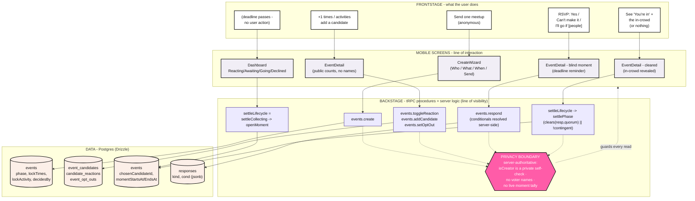

The same flow as a structured table, with the privacy invariant called out per step:

| # | Frontstage action | Mobile screen | Backstage procedure / logic | Data touched | Privacy invariant enforced |
|---|---|---|---|---|---|
| 1 | Send one meetup, anonymously | `CreateWizard` (Who / What / When / Send) | `events.create` - writes the plan; a fully pinned plan (one time + `lockTimes`, <=1 activity + `lockActivity`) skips collecting straight to a moment | `events` (`activity`, `groupId`, `createdByUserId`, `lockTimes`, `lockActivity`, `decidesBy`); `event_candidates` | **Anonymous creator:** `createdByUserId` is stored for accountability, but `isAnonymous` defaults `true` at the schema level and the read layer returns `isCreator` only as a private boolean self-check, never the creator's id - the group never learns who sent it. |
| 2 | +1 a time/activity; add a candidate; opt out | `EventDetail` (collecting); `Dashboard` (Reacting) | `events.toggleReaction`, `events.addCandidate`, `events.setOptOut` - each runs `settleLifecycle` first | `candidate_reactions`, `event_candidates`, `event_opt_outs` | **No voter names:** counts are aggregated server-side; the API returns per-candidate +1 totals, never the set of `userId`s. Opt-outs are private and clear that user's reactions so they drop from quorum silently. |
| 3 | None - the "Decides by" deadline passes | Any screen that reads the plan (`Dashboard` / `EventDetail`) | `settleLifecycle` -> `settleCollecting`: past `decidesBy`, picks the best-supported TIME (`pickWinnerOrBestId`), resolves the top ACTIVITY into the name if empty, then `openMoment` (guarded compare-and-set) | reads `event_candidates` + `candidate_reactions`; writes `events` (`phase='moment'`, `chosenCandidateId`, `momentStartsAt/EndsAt`, `startsAt`) | **Lazy + server-authoritative:** no scheduler; the transition happens inside a procedure on the next read/write. The guarded UPDATE (`phase='collecting' AND chosenCandidateId IS NULL`) means a concurrent lock cannot be clobbered. |
| 4 | RSVP Yes / Can't make it / I'll go if [people] | `EventDetail` - blind moment (deadline reminder) | `events.respond` - stores one commitment per user; conditionals (`cond`) resolved **server-side** | `responses` (`kind`, `cond` jsonb), upserted by the `responses_event_user_unique` index | **Blind moment:** the server returns no running tally and no who-is-in during the moment. Each person commits without seeing others, so nothing can be gamed or hedged against. |
| 5 | See "You're in" + the in-crowd, or see nothing | `EventDetail` - cleared (`Going`) or the plan is simply absent | `settleLifecycle` -> `settlePhase`: past `momentEndsAt`, `clears(resp, quorum) || !contingent` -> `cleared`, else `fizzled` | reads `responses`; writes `events` (`phase`, `status`) | **Fizzle leaves no trace:** a fizzled plan is hidden from every dashboard category and sends no failure notice. The in-crowd is revealed only *after* `momentEndsAt`, never mid-moment. |

#### How the blueprint defends each promise

The three privacy promises are not UI copy - they are structural properties of the backstage lane, which is why the blueprint puts the **privacy boundary** below the line of visibility:

- **Anonymous creator (always on).** `events.isAnonymous` defaults `true` at the schema level, and the read layer (`derivePlanView`) computes `isCreator` purely so the caller knows whether *they themselves* made the plan; it is returned as a boolean only, never the creator's id. Anonymity is therefore the *default that cannot be switched off for other viewers*, not a per-plan toggle the proposer might forget. This is the direct implementation of Tom's insight that anonymity turns "one person giving a proposal" into "a consensus."
- **No live tally in the moment, no names while voting.** During collecting the API exposes aggregate +1 counts but never the voter set; during the moment it exposes *nothing* about others until settlement. The "maybe cascade" (Luke) is impossible because there is no public flinch to see and no partial count to react to.
- **Silent fizzle.** Because phases settle lazily on read, a plan that misses quorum flips to `fizzled` the next time it is touched and then drops out of the dashboard entirely - no push, no dead thread, no "who killed it." This is the engineered opposite of the before-journey's stage 6.

Together the two journeys and the blueprint close the loop from research to build: the **before** map is the failure we measured (survey + interviews), the **after** map is the experience we designed against each validated insight, and the **service blueprint** shows that the design's central promises - anonymous, no maybe, no trace - live in the server's procedures and tables, not just in the words on the screen.

---

## 5. Prototyping techniques and the visual evolution

Prototyping on BeThere was a deliberate **fidelity ladder**, not a single mock-up. We started cheap and disposable to settle the concept, then escalated fidelity only when a real question demanded it - each rung answered a distinct question, and the answer justified climbing to the next. Because the build evolved through publicly testable releases, real friends could click through an authentic product at every stage, which is what turned "we think this works" into "we watched someone use it." This is prototyping "from concept, to feature, to experience": paper concept, then a working feature loop, then a deployed experience real people lived with.

### 5.1 The ladder at a glance

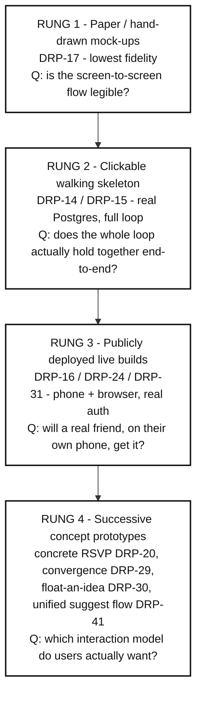

Each rung raised fidelity for a reason. We did not jump straight to a high-fidelity build, and we did not linger in paper once the flow was legible. Fidelity is a cost; we only paid it when a cheaper prototype could no longer answer the open question.

### 5.2 Authentic artefacts - the visual evolution

The two artefacts below are real, drawn-and-built outputs from the project, shown at opposite ends of the ladder. The hand-drawn M2 screens (Rung 1, DRP-17) are the literal paper concept; they map directly onto the journey and blueprint above.

**Rung 1 - hand-drawn M2 mock-ups (`docs/mockups/m2/ALL_MOCKUPS.pdf`, exported as PNGs in `docs/mockups/m2/screens/`):**

| The create screen (concept) | The "I'll go if..." moment sheet (concept) |
|---|---|
| 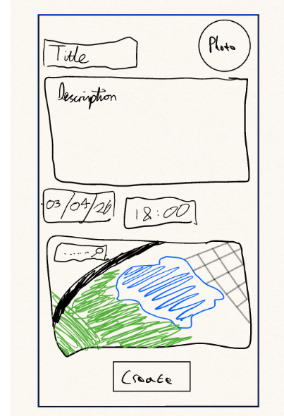 | 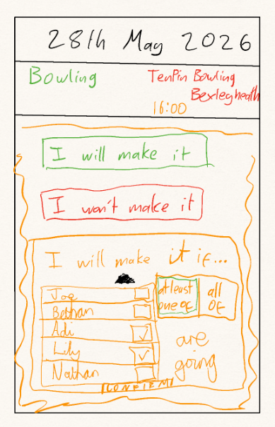 |
| *DRP-17. Tests whether the create flow reads as a sequence before any code.* | *DRP-17. The original sketch of the conditional RSVP - the exact feature Felicity later challenged.* |

These two sketches are why the fidelity ladder is more than prose: the create-screen concept became `CreateWizard`, and the hand-drawn "I will make it if..." panel (with friends and tick boxes) is the direct ancestor of the `events.respond` conditional in the blueprint - and of the unresolved naming tension in Section 6(c). Further M2 sketches (`home-a-plans`, `moment`, `reveal-whos-going`, `notification-results`, `groups-a-list`) cover the dashboard, the blind moment, the reveal, the BeReal-style notification, and group membership.

> **[TEAM TO FILL - authentic built-app screenshots.** The repo ships the hand-drawn artefacts above but does not contain captured screenshots of the running unified-suggest-flow build. To fully complete the "concept to feature to seamless experience" ladder, capture 2 to 3 screens from the live app (the create wizard, the collecting EventDetail with public vote counts, and a cleared "You're in" moment), and drop them in here alongside the sketches. They should show the refined-neobrutalism visual system from DRP-25, see `docs/m4/DESIGN_LANGUAGE.md`.]**

### 5.3 Technique-by-technique

| Technique | Iteration / issue | Fidelity | What it tested | What we learned |
|---|---|---|---|---|
| **Hand-drawn / paper-style screen mock-ups** (M2 set, `ALL_MOCKUPS.pdf`) | DRP-17 (align screens to hand-drawn M2 mock-ups) | Low (paper / static) | Is the screen-to-screen flow legible before any code? Does "send a plan -> react -> it's on" read as a sequence? | The skeleton of the journey held up on paper. It also exposed how much the *concept* (open vote vs fixed event) was still unsettled, which is why concept-level prototypes (Rung 4) came next rather than polish. |
| **Clickable walking skeleton** running the full loop on real Postgres | DRP-14 (persist the moment loop + architecture diagram), DRP-15 (full-loop walking skeleton) | Medium (working code, real data, thin UI) | Does the entire loop - create, RSVP, resolve conditionals, clear or fizzle - actually hold together end-to-end with persisted state, not just per screen? | A loop that works in one screen can still break across the join. Persisting to Postgres surfaced the real edges (state transitions, the silent fizzle) that paper hides, and gave us something a person could genuinely click rather than imagine. |
| **Publicly deployed live builds** - phone (Expo / EAS) and browser (Vercel web) with real Clerk auth | DRP-16 (deploy API live, AWS App Runner + RDS, with CD), DRP-24 (Clerk auth + Vercel web), DRP-31 (isolated dev deployment) | Medium-high (real product, real device, real account) | Will a real friend, on their own phone or in a browser, with their own login, understand and complete the flow unaided? | Putting it on a real device with a real account removed the demo crutch. It is what made the iteration-2 interviews (DRP-9) genuine usability tests of a *thing*, not a pitch - e.g. Tom: "There's no explanation, no tooltips... what is a group?" only surfaces when someone faces the cold app alone. The browser target (DRP-24) also directly answered Felicity's "It's foreign to download an app for this... a website would be less stressful." |
| **Successive interactive concept prototypes**, each embodying a different interaction model | DRP-20 (concrete-event RSVP pivot), DRP-29 (convergence model), DRP-30 (float-an-idea), DRP-41 (unified suggest flow) | High (each a real, testable build) | Which model do groups actually want: a fixed event to RSVP to, a poll that converges, an anonymous open-ended float, or one votable plan that does all three? | No single concept won on paper, so we built and tested them in turn. Each prototype settled one question and fed the next: concrete RSVP proved the commitment loop; convergence proved react-then-decide; float-an-idea validated anonymity and collaborative suggesting (Felicity: "you split the load across your friends"); and that evidence collapsed three modes into the **one** plan with two lock switches (DRP-41) - a design Tom had effectively asked for ("a checkbox or a switch... this is a concrete event, you cannot change it"). |

### 5.4 Why we escalated fidelity (the narrative)

We climbed the ladder because each rung *ran out of answers*.

**Paper (DRP-17)** was the right tool to check the flow was legible and to argue about the concept cheaply, before committing engineering effort. It could tell us the journey made sense; it could not tell us whether the *interaction model* was right, because a still image cannot show momentum counts changing, a blind moment resolving, or a plan silently fizzling. Those are behaviours, not pictures - so we needed something that runs.

**The walking skeleton (DRP-14 / DRP-15)** gave us behaviour. Wiring the full loop onto real Postgres meant the state machine (`collecting -> moment -> cleared` or `fizzled`) actually executed, conditionals resolved server-side, and the privacy guarantees (no running tally, fizzle leaves no trace) were real rather than promised. This answered "does it hold together?" but it was still us driving on our own machines. A skeleton you operate yourself flatters the design - you already know what every button does.

**Public live builds (DRP-16 / DRP-24 / DRP-31)** removed that flattery. Once the API was deployed with continuous delivery and the client ran on a real phone or in a browser behind real Clerk login, we could hand a friend the actual product and watch. This is the rung that made our round-2 interviews (DRP-9, the M3 thin-slice validation) trustworthy: Felicity, Luca and Tom were reacting to a live app, not a story about one. The findings that only emerge from cold, unaided use - missing onboarding ("what is a group?", Tom), the day-of-week gap ("that's a day. I don't even know if it's a Monday", Felicity), wanting to change an RSVP after locking (Tom) - all came from this rung, and fed directly into DRP-43's UX fixes. DRP-31's *isolated* dev deployment mattered too: it let us test risky concept builds with real users without disturbing the stable one.

**Concept prototypes (DRP-20 -> DRP-29 -> DRP-30 -> DRP-41)** are the rung that ran horizontally across the others. Because the central design question - *what is the right interaction model?* - could not be answered by reasoning alone, we built each candidate as a real, deployed prototype and tested it, rather than feature-piling onto one guess. The thin-slice path below shows the convergence: each concept was kept or folded based on what users did with it, and the evidence (anonymity de-risks initiating; people want to co-suggest; the activity often matters less than the company) compressed three separate modes into one votable plan with two lock switches.

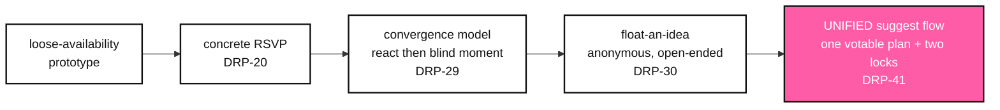

The throughline: we prototyped to *answer questions*, raising fidelity only when the current rung could no longer answer the next one - and because every rung from the walking skeleton onward was an authentic, runnable build (not a faked click-through), every test put a real product in a real user's hands.

---

## 6. Testing, validation and evolution

> BeThere was not designed once and shipped. It was steered. Across two interview rounds and one survey we put a hypothesis in front of real people, listened for where it broke, and changed the product. This section is the audit trail: the plan we tested against, the **finding-to-change traceability matrix** that links each piece of evidence to the commit it produced, the one finding that pushed *back*, and a reflection on the direction all of this gave us.

A note on honesty (per our integrity rules): the **survey (43 responses, 19 to 20 May 2026)** and the **7 interviews (two rounds)** are real and are quoted here. We did **not** run moderated, instrumented usability sessions (no System Usability Scale, task-completion, or time-on-task numbers were collected). Round 2 was a qualitative demo walkthrough, not a metric study. The ready-to-run instrument for capturing those numbers lives in the quantitative-evaluation report (`docs/m4/quantitative-evaluation.md`); nothing in this section is an invented measurement.

---

### (a) Testing Plan Canvas

Each round had a single job. We tested the *riskiest open assumption* at that point, not the whole product.

| Round | Objective / hypothesis under test | Who we tested with | Method | Success criteria - what we looked for |
|---|---|---|---|---|
| **R0 - Survey** (19 to 20 May 2026) | "Plans really do die in the gap between intention and a fixed time, and the failure mechanism is the *maybe* / silence, not flaking on the day." | 43 respondents (friend-group planners) | Self-completion **survey** (Google Forms: group size, failure rate, ranked barriers, the "slightly unsure" response, the private-signal appetite) | A *majority* report plans dying; the dominant "unsure" reply is maybe/silence (not a clear yes/no); a real appetite for a private signal. If most people sent clear answers and rarely lost plans, the premise was wrong. |
| **R1 - Discovery interviews** | "Why does the maybe cascade, and who carries the coordination effort?" Understand the felt experience behind the survey numbers. | 4 participants - **Luca, Luke, Matthew, Noah's friend** | 1:1 **discovery interviews** (semi-structured, audio, auto-transcribed) | Rich causal stories that explain the survey: evidence of contagious uncertainty, asymmetric organiser effort, and what a fix might look like in users' own words. |
| **R2 - Moderated demo walkthrough** (DRP-9, HCD-labelled) | "Does the *built* unified suggest flow remove the organiser and the public maybe without creating new friction?" Validate the thin slice. | 3 participants - **Felicity, Luca (return), Tom** | **Moderated demo walkthrough** of the running app, think-aloud + targeted probes on anonymity, the conditional RSVP, locking, and the candidate lists | Participants grasp the model unprompted; endorse anonymity and collaborative suggesting; surface concrete UX gaps; and flag anything that *fails* in front of them. We explicitly looked for disconfirming evidence, and found some (see the conditional-RSVP finding). |

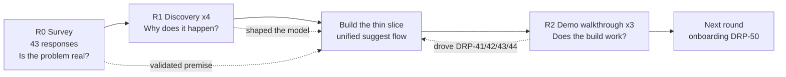

The loop is deliberately tight: survey to confirm the problem is worth solving, discovery to understand it, a build, then a walkthrough of the real thing that fed straight back into the backlog.

---

### (b) The key evidence table - finding-to-change traceability matrix

This is the heart of the section: every column-three change is a real DRP issue, and every row-one finding is real survey data or a real interview quote. Survey figures are exact counts from `docs/drp-context/Friend Meetup Dynamics Survey (Responses) - Form Responses 1.csv` (n = 43).

| Finding (source) | Insight | Change we made (DRP issue) |
|---|---|---|
| When only *slightly unsure*, the dominant replies are **"a maybe / tentative acceptance" (27 of 43)** and **"nothing yet / silence" (10 of 43)** - only **4** send a clear yes and **1** a clear no (survey). | The default reaction to uncertainty is to hedge or go quiet. A public "maybe" is the failure mechanism. | The moment is a **blind, deadlined RSVP** - **Yes / Can't make it / "I'll go if [people]"**, with **no public maybe** and no running tally. Convergence model (DRP-29), unified into the suggest flow (DRP-41). |
| "When someone expresses some kind of uncertainty, it kind of cascades uncertainty on the group... that is a website written off" (Luke). The chat goes "completely empty" when a plan dies (Luke). | Uncertainty is socially contagious; one early hedge collapses the group's certainty. | Votes and RSVPs are **server-authoritative and blind** during the moment - no one sees an early wobble, so it cannot cascade. A fizzle is **silent and hidden** from the dashboard, no dead-plan residue (DRP-29, DRP-41). |
| "The organiser should have an option to be anonymous... nobody likes being the one making people commit... it's more of a consensus than one person giving a proposal" (Tom). Survey: leadership is **"evenly distributed" (20)** or **"mostly one specific friend, not me" (13)**; only **4** say "mostly me". | Effort is asymmetric and nobody wants to be the organiser. Anonymity reframes a plan as group consensus, not one person's ask. | **Creator anonymity is always-on** - the group sees the meetup, never who proposed it. No "anonymous" toggle to forget; it is the default and only mode (DRP-41). Copy: "No names, just the group." |
| "It's like you split the load across your friends... you can suggest things people might not want to go to without feeling like you're dragging everyone to it" (Felicity). Survey: **36 of 43** say smaller groups are easier, larger groups harder. | People want to **co-decide**, not be organised. Spreading suggestion across the group reduces the pressure of "dragging" anyone. | Two public, member-fed candidate lists - **TIME** and **ACTIVITY** - that any member can add to and **+1** during collecting. Counts are public (momentum), **names never** (DRP-41, DRP-30 "float an idea"). |
| "I care less about what we do... I just want to see them" (Felicity). Survey: "Activity idea" is rarely an *Often* barrier (**4 of 43**) versus **clashing schedules at 23 of 43**. | The company often matters more than the activity. Forcing an activity choice is friction. | The **activity is optional**. A plan can be sent as time-only; the most-voted activity becomes the plan's name *if one is not already set*. The activity is votable, not mandatory (DRP-41, DRP-42). |
| "A checkbox or a switch... this is a concrete event, you cannot change it... like a football match" (Tom). Tom also found single-time vs multi-time confusing and wanted "one time field with an *add a time* below". | Concrete and open plans are both needed - one switch should cover both, not separate modes. | The **lockTimes / lockActivity flags** (both default open). A fully pinned plan skips collecting and opens straight into a blind timed moment - the old "concrete" plan - via *one model* with two switches, replacing the earlier three-mode fork (DRP-41). |
| "The deadline would be a better choice... but only if there was a push... like BeReal, it goes off, ding ding ding"; wants a sensible default lock-in, e.g. the day before (Tom). Luke independently described a "BeReal-style push notification with a yes/no and a timer". | A blind, deadlined, push-driven yes/no beats an open-ended poll with a maybe. | **Lock-in deadline + bounded additions**: voting closes on a deadline, the top picks lock automatically, then the timed moment runs (DRP-32, folded into DRP-41). Device-local "Decides soon" / "Who's in?" / "RSVP closing" reminders are scheduled by `apps/mobile/src/lib/notifications.ts`. |
| "I'll see 20th of June and I'll go, well, that's a day, I don't even know if it's a Monday" (Felicity); "that should probably be an actual location"; "you probably want duration"; wants a description / notes box (Felicity). | The moment screen lacked the everyday scaffolding people need to actually commit (day-of-week, place, duration, notes). | **UX fixes**: day-of-week in dates, location field, notes, plain-language countdown, lock-placement and typography fixes (DRP-43). Plans became **member-editable** (activity/location/notes) via per-field compare-and-set (DRP-43). |
| "Would it be possible to change your decision afterwards?... make the button clearer / pink" (Tom). | An RSVP is not always final; people need a clear, reversible commit. | RSVP-change handling and clearer affirmative styling addressed in the UX and polish passes (DRP-43, DRP-44); pink reserved for the primary "reply now" action per the visual system (DRP-25). |
| "There's no explanation, no tooltips... what is a group?" (Tom). | The thin slice had no onboarding; the model is novel and needs a first-run explanation. | Scoped as **group onboarding - invite links, join codes, first-run** (DRP-50, currently In Progress, M4). Honestly tracked, not yet shipped. |
| A bus reunion died because "days went past... it just got more drawn out... social self-doubts crept in and more people pulled out" (Matthew); "second thoughts grow the longer a plan sits unresolved" (Matthew). | Open-ended, unresolved plans rot. Time pressure is a feature, not a flaw. | The **deadline** bounds how long a plan can sit open before it resolves or fizzles (DRP-32, DRP-41), directly countering the "drawn-out" decay Matthew described. |
| "I'd be up for something this week" private signal: **20 of 43** would use it *more* than messaging the group, **14** the same; 8 same-or-negative beyond that (4 "less often", 4 "wouldn't use it") (survey). Plus a redo wish implied by repeat hangouts. | There is real appetite for a low-pressure, private way to float intent, and for repeating what worked. | The collaborative, anonymous candidate model **is** that private-feeling signal; and the create flow can **redo** a past cleared meetup, cloning it as a locked activity so you only pick a new time (DRP-42). |

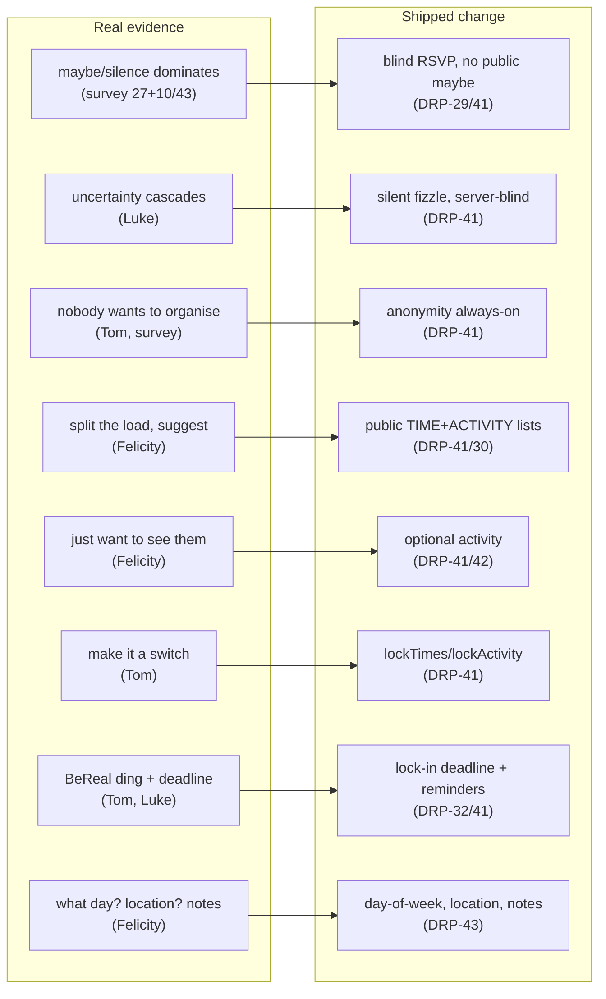

---

### (c) Honest note - the finding that pushed back

Not every test confirmed the design. The clearest disconfirming evidence in Round 2 was Felicity's reaction to the **conditional RSVP** ("I'll go if [people]"):

> "If you guys are making me put something in which says I'm only going if Jess goes, I can't do that. I wouldn't be able to say it out loud. Regardless of how private it is... I would feel so awkward actually writing down which of my friends I wanted to see." (Felicity, iteration interview)

This is a genuine, **unresolved tension**, and we are recording it rather than burying it. The feature is built on a sound insight - Luke's organic "I'm down if others are down" - and Tom liked being able to pick specific people. But "I'll go if [named friend]" can feel like an admission, even when the app guarantees it is private and server-resolved. Felicity's counter-proposal was to **rank importance instead of naming a person**, which would deliver the same conditional logic without the social exposure of writing down whose presence you are waiting for.

We have not yet redesigned the conditional, so we are honest about the state: the privacy guarantee is real and server-authoritative, but **felt** privacy and **technical** privacy are not the same thing, and one of our three Round 2 participants hit that gap hard. The candidate fix (importance ranking, or an opt-in rather than a named target) is on the table for a future round, and it sits alongside two other Round 2 challenges we have only partly answered: Tom's "what is a group?" (no onboarding, now scoped as DRP-50) and Felicity's "it's foreign to download an app for this... a website would be less stressful" / "why would you bother going here if you're on WhatsApp anyway?" - a platform and distribution question this thin slice does not resolve.

---

### (d) Reflection - how feedback gave the design a clear direction

The research did more than validate features; it set the **direction**, and it did so by repeatedly pointing at the same small set of truths from different angles.

- **The survey told us what to fight.** With 27 of 43 hedging and 10 going silent when slightly unsure, and only 5 sending a clear answer (4 yes, 1 no), the enemy was named precisely: the public maybe. Everything downstream - blind RSVPs, no running tally, silent fizzle - is one move against that single mechanism.
- **The discovery interviews told us why.** Luke's "cascades uncertainty" and Matthew's "second thoughts grow the longer a plan sits" turned a statistic into a mechanism: contagion plus decay. That is why the moment is both **blind** (stops contagion) and **deadlined** (stops decay), not just one or the other.
- **The walkthrough told us it works, and where it does not.** Tom independently argued for anonymity and for a single "concrete event" switch - the exact shape of our always-on anonymity and the lockTimes/lockActivity flags - which is about as strong a signal of product-market fit as a qualitative round can give. Felicity loved the collaborative suggesting for the same reason the survey predicted she would (36 of 43 find big groups harder; splitting the load is the relief). And the same session produced concrete, shippable gaps - day-of-week, location, duration, notes - that became DRP-43 within the same milestone.

The convergence is the point. Three independent sources (a 43-person survey, four discovery interviews, three demo walkthroughs) kept landing on the **same three insights** - the maybe kills plans, nobody wants to organise, people want to co-decide - and the unified suggest flow (DRP-41) is the single design that answers all three at once: no public maybe, no named organiser, two shared candidate lists. The feedback did not just refine the product; it collapsed three earlier modes (float / flexible / concrete) into one coherent model, and it left us with a clear, evidence-backed next question - **felt privacy in the conditional, and onboarding for a novel model** - to carry into the next round.

---

## 7. Understanding impact, the cover story, and reflection

> This closing section steps back from screens and schemas to ask the human question the rubric cares about: **what changes for people because BeThere exists?** It then uses the **Cover Story** HCD method to picture the world if we got it right, and ends with a candid reflection on how Human-Centred Design reshaped the product and what we would still do differently.

---

### 7.1 Understanding impact

We frame impact deliberately and modestly. We have a 43-response survey, seven interviews (two of them testing the built app), and a working thin slice; we do **not** yet have longitudinal usage data. So the claims below are framed as **the change the design is intended to produce**, each tied to the evidence that the underlying problem is real, with the measurement instruments to confirm it set out in the quantitative-evaluation report (a deliberate split between *what we know* and *what we must still measure*).

#### 7.1.1 The change for primary users (friend groups, students, young adults)

The product targets one specific failure: a loose intention to meet never becomes a fixed time and place. Three mechanisms in BeThere map directly onto the three validated insights.

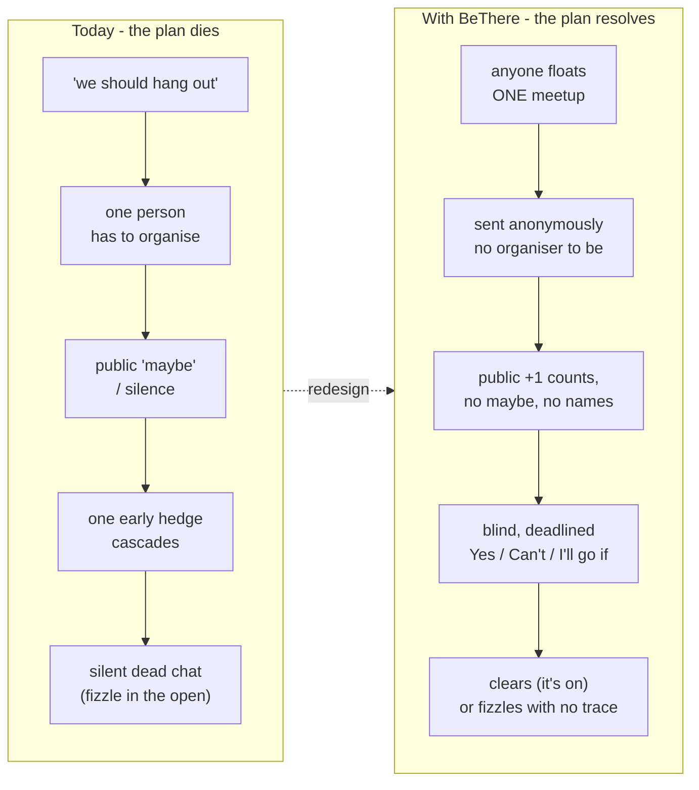

| Intended change for users | Mechanism in BeThere | Grounding evidence |
|---|---|---|
| **More loose intentions become real meetups.** The bottleneck is suggestion and commitment, not execution, so we attack the moment before a time is fixed. | The unified suggest flow (DRP-41) lets anyone float one plan with candidate times/activities; voting resolves the "first time rarely sticks" problem automatically. | Survey: a substantial share of hangouts were "talked about but never happened"; initial date/time "rarely" agreed without change. Luca: "almost more a lack of suggestion than the lack of execution." |
| **The maybe/silence death-spiral is removed.** There is no public "maybe" to send and no running tally to read the room from. | RSVP is **Yes / Can't make it / "I'll go if [people]"** - no maybe option. The moment is **blind**: no who-is-in, no live count, so an early "Can't" cannot cascade. | Survey: the dominant response to slight uncertainty is "a maybe" or "silence" (37 of 43). Luke: "when someone expresses some kind of uncertainty, it cascades uncertainty on the group... that is a website written off." |
| **The reluctant initiator is freed.** Nobody has to own the ask, the chase, or the awkwardness of making people commit. | **Creator identity is always anonymous**; the plan reads as the group's, not one person's. Counts show momentum without exposing voters. | Survey: coordination is "mostly one specific friend (not me)" (13 of 43); only 4 lead. Tom: "people are always really self-conscious of being the one to push things... by being able to make it anonymous there's no pressure on that person at all... It's more of a consensus than one person giving a proposal." |

These are the *primary* user benefits, and they reinforce each other: removing the maybe only helps if someone still dares to suggest, and anonymity is what lets them.

#### 7.1.2 The change for other stakeholders

**The group, not the individual.** BeThere shifts effort from one organiser to a shared decision. Members co-suggest both *when* and *what/where*, and any member (not just the creator) can edit a live plan's activity, location and notes. Felicity articulated the value precisely: "it's like you split the load across your friends... you can suggest things that actually people might not want to go to without feeling like you're dragging everyone to it." This reframes the stakeholder from "an organiser plus passive invitees" to "a group co-deciding".

**Venues and hosts (an indirect stakeholder) get a firmer signal.** A cleared plan carries a confirmed time, a settled activity, a location and a known "in" headcount; an unresolved WhatsApp thread carries none of that. The concrete better outcome for the venue or host on the receiving end is a firmer booking and attendance signal at the point a plan clears, and fewer half-formed enquiries that never convert - the location and notes fields (DRP-43) and the resolved going-count are exactly what a host needs.

**Hosted services and the data-protection duty BeThere creates.** Running on Clerk, AWS, Vercel and Expo/EAS is a contractual dependency, and storing user identities, group membership and RSVP behaviour creates a concrete UK GDPR obligation: the worse-outcome risk for this stakeholder ring is real personal data about who plans with whom, so lawful-basis, retention and deletion duties must be honoured. The silent-fizzle design helps here - a failed plan leaves no trace and is hidden from every dashboard - but the duty is created the moment we persist a single RSVP, and it is documented in the copyright/legal report.

**The wider angle: friendship maintenance and social connection.** Our most generalisable - and most carefully bounded - claim is about social isolation. Term-time disperses friend groups, and the coordination cost of regrouping is exactly the cost BeThere lowers. Matthew described a reunion that "got more drawn out... social self-doubts ended up creeping in and more and more people ended up pulling out", and the survey shows the failure is common rather than rare. If the tool helps groups clear that low-stakes coordination hurdle, the downstream good is more in-person contact among young adults and students who otherwise drift apart. Felicity's line - "I care less about what we do though, I just want to see them" - is the human core: the activity is a pretext for connection, so a tool that makes *seeing each other* easier is, modestly, a tool for maintaining friendships.

> **We do not over-claim.** BeThere does not cure loneliness, and we have not measured wellbeing. The honest statement is narrower and defensible: *the design removes a specific, evidence-backed friction that causes low-stakes plans to die, which should let more of them happen.* The intended-impact metrics (meetup conversion rate, organiser-burden self-report, "plans that fizzled silently") are specified as ready-to-run instruments in the quantitative-evaluation report; the figures there are marked **[TEAM TO FILL]**.

---

### 7.2 The Cover Story (HCD method)

The Cover Story is a future-casting exercise: assume the project has fully succeeded, then write the magazine cover that the world produces as a result. It forces the team to name the *outcome we are actually designing for*, not the features we shipped. The designed, on-brand visual version is the self-contained companion file **`docs/m4/cover-story.html`** (refined-neobrutalism, lavender-to-blush gradient, Archivo/Inter, pink `#FF5CA8` primary, hard offset shadows; prints to one A4 page). Below is the written version.

> **THE FRONT PAGE - illustrative future-casting, not a claim of measured results.**

#### Headline

# "Nobody's the organiser any more - and the group still showed up"

##### *How a no-maybe app quietly fixed the death of the group plan*

#### The story (illustrative)

It used to take forty messages and one exhausted friend to get five people in the same room - and usually it failed in a silent chat that nobody wanted to be the first to kill. That friend does not exist any more. The plans just arrive: a time, maybe a place, sent by *the group*, signed by no one.

There is no "maybe" button to hide behind, and no running tally to second-guess. You vote, you wait, and at the deadline it either lands - "you and four others are in" - or it disappears without anyone losing face. The drawn-out reunion that quietly dissolved while everyone hedged is a thing people now struggle to remember.

The quiet headline is not the app. It is that friends who used to drift apart in term time are, simply, seeing each other again.

> *Design note:* the cover is intentionally built from real evidence, not aspiration. "Forty messages then a silent chat" is the before-state our interviewees described (Luke, Matthew); "no maybe, no names, the group's not one person's" is the mechanism we built and tested (Tom, DRP-41). The fictional framing is the *consequence*; every premise underneath it is grounded.

---

### 7.3 Reflection

#### 7.3.1 How HCD changed the product

The strongest evidence that we did Human-Centred Design rather than feature-led design is that **the product model itself changed in response to users**, repeatedly. The git/Linear history shows a chain of *tested refinements*, not feature-piling:

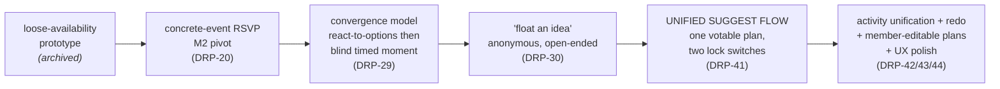

Three decisions, in particular, were made *for us* by the evidence:

1. **Three modes collapsed into two locks.** We started fighting over whether a plan was "float", "flexible" or "concrete" and built a three-mode fork. Tom rejected the framing in his own words - he wanted **one time field with an "add a time" below, plus "a checkbox or a switch... this is a concrete event, you cannot change it... like a football match."** That switch became `lockTimes`/`lockActivity`, and the three-mode fork was deleted entirely in the unified suggest flow (DRP-41). A real user simplified our information model.

2. **Anonymity moved from a nice-to-have to the spine of the product.** Tom's "the organiser should have an option to be anonymous" hardened into **always anonymous, server-authoritative** (`isAnonymous` defaults true at the schema level; `isCreator` is only ever a private self-check, never another viewer's name) - public counts but never voter names. This is the single decision that addresses the asymmetric-effort insight, and it came straight from an interview.

3. **We let "show up" beat "pick the perfect activity".** Felicity's "I care less about what we do, I just want to see them" is why activity is *optional and votable*, not a required field, and why the plan's name can simply be the winning activity.

#### 7.3.2 The tension we are NOT hiding: the conditional framing

Our most uncomfortable finding is a feature we were proud of. The **"I'll go if [people]"** conditional was meant to be a private, safe way to express a real social truth ("I'll come if my friend does"). Felicity rejected it on its face:

> "If you guys are making me put something in which says I'm only going if Jess goes, I can't do that. I wouldn't be able to say it out loud. Regardless of how private it is... I would feel so awkward actually writing down which of my friends I wanted to see." (Felicity, iteration interview)

This directly contradicts Tom, who *liked* being able to pick specific people. We have a genuine, unresolved design tension, and the HCD-honest response is to surface it, not to average it away. Felicity's own counter-proposal - **rank importance rather than name names** - is the leading candidate for the next iteration, and it is logged as future work rather than quietly shipped as if validated.

#### 7.3.3 What we would do differently / future work

| Theme | What we learned | What we would do |
|---|---|---|
| **Onboarding** | Tom: "There's no explanation, no tooltips... what is a group?" We tested the loop before the front door. | Group onboarding (invite links + join codes + first-run) is in flight as **DRP-50 (M4, In Progress)**; we would have prioritised it earlier so iteration interviews tested the whole journey, not just the core loop. |
| **The BeReal-style push** | Luke and Tom both independently asked for a deadlined "ding ding ding" nudge - it is core to the no-maybe model, not decoration. | The reminders are **built as device-local scheduled notifications** ("Decides soon" / "Who's in?" / "RSVP closing", in `apps/mobile/src/lib/notifications.ts`), which is enough for a co-located demo. What is **deferred is true remote push**: device-local scheduling can only fire for plans a device has already loaded, and reliable server-driven push needs a dev build (`expo-dev-client`) rather than Expo Go on SDK 54. We would do the dev build before the next round so the deadline mechanic can be tested unattended. |
| **The conditional naming tension** (7.3.2) | Privacy did not remove the social discomfort of naming a friend. | Prototype Felicity's "rank importance" alternative and test it against named conditionals in the next interview round. |
| **App vs website** | Felicity: "It's foreign to download an app for this. I think a website would be less stressful... Why would you bother going here if you're on WhatsApp anyway?" | We already ship a web target (React Native Web on Vercel). We would test a low-friction **link-first / web-first** entry, and seriously examine the integration question - the app must justify itself against the group chat people already live in. |
| **Smaller usability papercuts** | Felicity wanted day-of-week ("I don't even know if it's a Monday"), real locations, duration, a notes box; Tom wanted relative times ("this Saturday 9pm") and to change an RSVP after locking in. | Several are addressed (member-editable location/notes/activity, plain-language countdown, lock placement - DRP-43/44); the relative/preset time picker and editable post-lock RSVP remain on the backlog. |
| **Evidence we still lack** | We have strong *qualitative* validation and survey breadth, but no task-completion, SUS, or longitudinal conversion data. | Run the moderated usability instrument and the impact survey specified in the quantitative-evaluation report. Those values are **[TEAM TO FILL]** - we will not present an intended outcome as a measured one. |

**The honest bottom line.** Human-Centred Design did not just decorate BeThere; it **deleted features** (the three-mode fork), **promoted a flag to a principle** (always-anonymous), and **left a real tension on the table** (naming people in conditionals) rather than pretending we resolved it. The product is smaller and sharper than the one we first imagined, and that narrowing is the clearest signal that we were listening.
