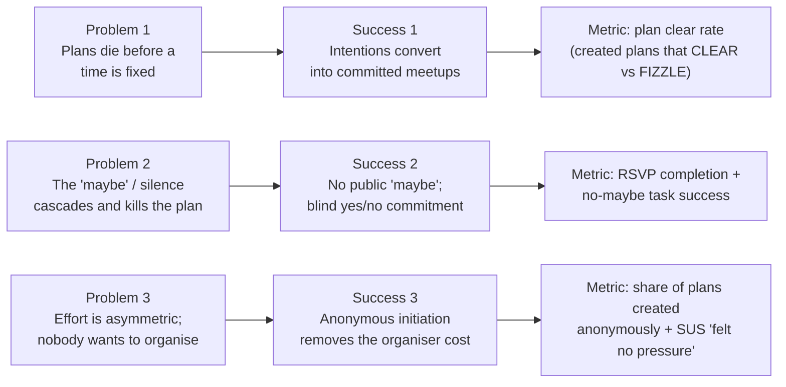
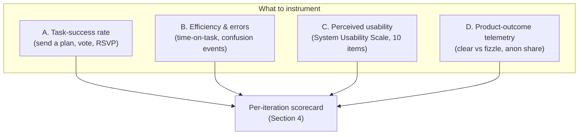
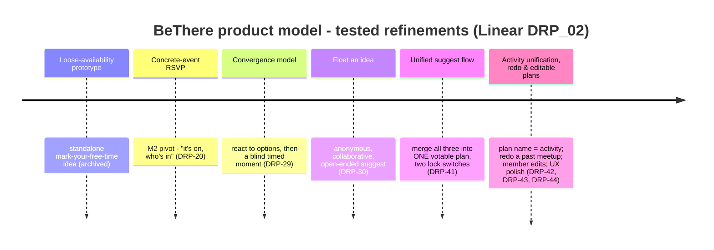
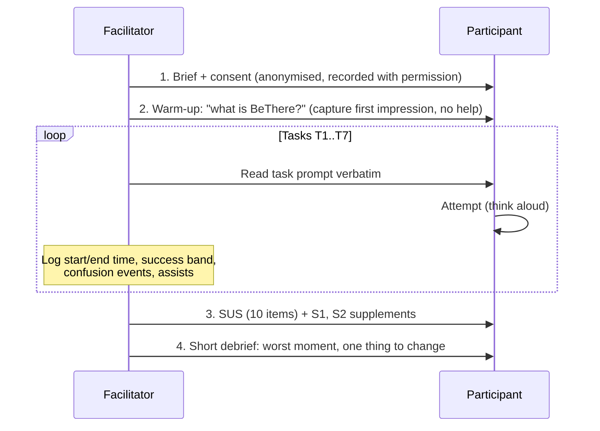

# BeThere - Quantitative and Objective Evaluation

> BeThere turns a vague "we should hang out" into a firm plan with no organiser and no public "maybe". This document sets out how we measure whether it does that, grounds the baseline in our real survey (n = 43), and hands the team a ready-to-run instrument kit to fill the usability numbers before the M4 submission.

**Integrity note.** Two kinds of evidence appear below and are kept strictly separate. **(a) Real, collected data** - the Friend Meetup Dynamics Survey (43 responses, 19 to 20 May 2026) and seven interviews across two rounds. These are quoted and tallied directly from source. **(b) Instruments to be run** - usability metrics (System Usability Scale, task-success, time-on-task, product-outcome telemetry) that were **not** moderated and collected yet. Every such cell is marked `[TEAM TO FILL]`, and any worked figure is labelled **ILLUSTRATIVE** in the same sentence. No invented number is ever presented as a measured result.

---

## 1. Evaluation aims: what "success" means for BeThere

BeThere exists to fix one failure: group plans die in the gap between "we should meet up" and an actual time and place. The research names three mechanisms behind that death, and our evaluation targets one outcome for each.



The three success definitions, each tied to a measurable claim:

1. **Turning intentions into committed meetups.** A plan that is created should reach a real, attended meetup more often than the status quo chat does. The product can measure this directly: the share of created plans that **clear** versus **fizzle**.
2. **Removing the "maybe" / silence failure.** Members should be able to commit (Yes / Can't make it / conditional) without a public hedge, and should actually complete that commitment. We measure RSVP task-success and the absence of a "maybe" escape hatch in the flow.
3. **Reducing organiser asymmetry.** Initiating a plan should not feel like volunteering to be the organiser. Because creator identity is **always anonymous**, the cost of pushing should drop; we measure it through SUS items and the share of plans created at all (people willing to start one).

These aims drive both the **baseline** (Section 2, what the world looks like without BeThere) and the **product metric framework** (Section 3, how we judge each iteration).

---

## 2. Baseline metrics from the real survey (n = 43)

**Source:** Friend Meetup Dynamics Survey (Responses), 43 respondents, collected 19 to 20 May 2026. File: `docs/drp-context/Friend Meetup Dynamics Survey (Responses) - Form Responses 1.csv`. All figures below are exact counts re-tallied from that file; percentages are of n = 43 unless a question had blank responses, in which case the valid-response base is stated.

> **Sampling limitation (state plainly).** This is a **convenience sample** of n = 43 from the target demographic (young adults / students who try and sometimes fail to make group plans). It is **not** a random or representative sample, so figures describe this group and the design rationale they support, not a population estimate. Treat them as strong directional evidence for the problem, not as population statistics. The baseline's job is to establish the problem is real and common, and to anchor what the product must beat.

### 2.1 The problem is common, not rare

**Proportion of hangouts talked about but never happened (last 3 months):**

| Bucket | Count | Share |
|---|---:|---:|
| 0 to 10% | 6 | 14.0% |
| 10 to 30% | 14 | 32.6% |
| 30 to 50% | 10 | 23.3% |
| 50 to 75% | 9 | 20.9% |
| 75 to 100% | 4 | 9.3% |
| **Total** | **43** | **100%** |

```text
Hangouts that never happened (share of respondents)
0 to 10%   ######          6  (14.0%)
10 to 30%  ##############  14 (32.6%)
30 to 50%  ##########      10 (23.3%)
50 to 75%  #########        9 (20.9%)
75 to 100% ####             4  (9.3%)
```

**Key figure:** 23 of 43 respondents (**53.5%**) report that **30% or more** of their planned hangouts never happen; 13 of 43 (**30.2%**) say half or more never happen. Plan death is the norm, not an edge case. This is the headline number the product must move: BeThere's clear-vs-fizzle telemetry (Section 3) is the direct comparator.

### 2.2 The "maybe" and silence are the failure mechanism

**When only slightly unsure you can make a plan, what response do you send?**

| Response | Count | Share |
|---|---:|---:|
| A "maybe" or tentative acceptance | 27 | 62.8% |
| Nothing yet (silence / delaying) | 10 | 23.3% |
| A clear yes | 4 | 9.3% |
| A clear no | 1 | 2.3% |
| "I tell them I'm unsure, I'll get back to them" (free text) | 1 | 2.3% |

```text
Default response when slightly unsure
maybe / tentative   ###########################  27 (62.8%)
silence / delay     ##########                   10 (23.3%)
clear yes           ####                          4  (9.3%)
clear no            #                             1  (2.3%)
other (will revert) #                             1  (2.3%)
```

**Key figure:** 37 of 43 (**86.0%**) default to a **"maybe" or silence** when slightly unsure; only 4 of 43 (**9.3%**) send a clear yes. This is the single most important baseline number. It is direct quantitative backing for the qualitative insight that "uncertainty is socially contagious" (Luke: "when someone expresses some kind of uncertainty, it kind of cascades uncertainty on the group"). BeThere's design response is to remove the public "maybe" entirely: a blind moment with Yes / Can't make it / conditional only. The objective check is that the flow offers **no "maybe" control** and that RSVPs complete.

**Flaking is also admitted directly.** Have you ever lied or made up an excuse to avoid a planned meetup?

| Answer | Count | Share |
|---|---:|---:|
| Yes, occasionally | 21 | 48.8% |
| No, never | 19 | 44.2% |
| Yes, often | 3 | 7.0% |

24 of 43 (**55.8%**) admit to having lied to avoid a meetup at least occasionally - the "maybe" hedge has a downstream cost that members themselves recognise.

### 2.3 The first proposed time rarely sticks (validates voting on times)

**How often does the initial suggested date/time get agreed without change?**

| Answer | Count | Share |
|---|---:|---:|
| Almost always | 2 | 4.7% |
| Often (more than 75%) | 8 | 18.6% |
| About half the time (~50%) | 16 | 37.2% |
| Rarely (less than 25%) | 12 | 27.9% |
| Almost never | 5 | 11.6% |

**Key figure:** only 10 of 43 (**23.3%**) say the first proposed time is agreed often or almost always; 33 of 43 (**76.7%**) say it sticks half the time or less. The first time almost never just works, which validates a **votable time list** over a single proposed slot (and matches Felicity's "soft time" concern and Luca's poll workflow).

### 2.4 Larger groups are harder (the product targets the hard case)

**Has it been easier to make plans for a larger group?**

| Answer | Count | Share |
|---|---:|---:|
| No, smaller groups make it easier | 36 | 83.7% |
| The group size does not matter | 7 | 16.3% |
| (Yes, larger is easier) | 0 | 0% |

**Key figure:** 36 of 43 (**83.7%**) say smaller groups are easier; **not one** respondent found larger groups easier. Most respondents coordinate in a 4 to 6 person group (25 of 42 valid, 59.5%), which is exactly the band where the problem bites.

**Group size respondents coordinate in:**

| Size | Count | Share (valid n = 42) |
|---|---:|---:|
| 2 to 3 | 13 | 31.0% |
| 4 to 6 | 25 | 59.5% |
| 7+ | 4 | 9.5% |

### 2.5 The private signal is in demand (validates anonymity)

**Would you use a private "I'd be up for something this week" signal (invisible unless it matched others) more, the same, or less than messaging the group?**

| Answer | Count | Share (valid n = 42) |
|---|---:|---:|
| More often than messaging the group | 20 | 47.6% |
| The same amount | 14 | 33.3% |
| Less often than messaging the group | 4 | 9.5% |
| I wouldn't use this feature | 4 | 9.5% |

**Key figure:** 34 of 42 valid responses (**81.0%**, or 79.1% of all 43) would use a private/anonymous signal **at least as much as** messaging the group, and 20 (47.6%) would use it **more**. This is quantitative support for the always-anonymous, momentum-based collecting model.

### 2.6 Initiation is asymmetric and respondents do not see themselves leading

**Who typically takes the lead in initiating and coordinating meetups?**

| Answer | Count | Share (valid n = 42) |
|---|---:|---:|
| Evenly distributed among a few friends | 20 | 47.6% |
| Mostly one specific friend (not me) | 13 | 31.0% |
| No one consistently takes the lead | 5 | 11.9% |
| Mostly me | 4 | 9.5% |

**Key figure:** 38 of 42 valid responses (**90.5%**, or 88.4% of all 43) do **not** see themselves as the main organiser; only 4 (9.5%) say "mostly me". The organiser role is concentrated or absent, never owned by the respondent - the asymmetry the anonymity feature is built to dissolve (Tom: "nobody likes being the one that is making people commit to ideas or chasing people up").

### 2.7 What gets in the way (barrier ranking)

Respondents rated each barrier Often / Sometimes / Rarely / Never. Ranked by "Often" share:

| Barrier | Often | Sometimes | Rarely | Never |
|---|---:|---:|---:|---:|
| Clashing schedules | **23 (53.5%)** | 13 | 5 | 2 |
| Distance | 14 (32.6%) | 14 | 10 | 5 |
| Bad communication | 10 (23.3%) | 13 | 17 | 3 |
| Lack of motivation | 7 (16.3%) | 16 | 12 | 8 |
| Activity idea | 4 (9.3%) | 17 | 11 | 11 |
| Disagree on location | 4 (9.3%) | 7 | 18 | 14 |

```text
"Often" a barrier (share of respondents)
Clashing schedules   #######################  23 (53.5%)
Distance             ##############           14 (32.6%)
Bad communication    ##########               10 (23.3%)
Lack of motivation   #######                   7 (16.3%)
Activity idea        ####                      4  (9.3%)
Disagree on location ####                      4  (9.3%)
```

**Clashing schedules** is by far the most frequent "Often" barrier (53.5%), with **bad communication** a notable third (23.3% Often, and only 7% Never). Disagreeing on location and the activity idea are the **least** "Often" barriers - reinforcing insight 6, "I care less about what we do, I just want to see them" (Felicity), and the decision to make the activity optional and votable while the time list is the centre of gravity.

### 2.8 Baseline summary (the numbers BeThere is built to beat)

| Baseline metric (survey, n = 43) | Value | What the product targets |
|---|---:|---|
| Plans that never happen (>= 30% of hangouts) | 53.5% of respondents | Plan clear rate (Section 3.4) |
| Default to "maybe" or silence when unsure | 86.0% | No-maybe RSVP flow; RSVP task-success |
| First proposed time sticks (often / always) | 23.3% | Votable time list; vote task-success |
| Smaller groups easier than larger | 83.7% | Works in the 4 to 6 band specifically |
| Would use a private signal at least as much | 81.0% (valid base) | Always-anonymous collecting |
| Do not see themselves as the organiser | 90.5% (valid base) | Anonymous initiation; willingness to create |
| Admit to having lied to avoid a meetup | 55.8% | Honest, low-pressure commitment |

These seven rows are our **defensible quantitative evidence**. Everything in Section 3 is the instrument set to measure whether the built product actually shifts behaviour against this baseline.

---

## 3. Metric framework for evaluating the product across iterations

The baseline measures the **problem**. This section defines objective metrics for the **product**, in four families. Families A to C require running an instrument on participants; family D can be measured directly by the app itself.



### 3.1 Family A - Task-success rate (effectiveness)

For each core task, a participant either completes it unaided (success), completes it with a hint or recovery (partial), or fails. Report the share in each band plus a binary success rate (success / total).

Core tasks, mapped to the product model:

| Task ID | Task | Maps to | Success criterion |
|---|---|---|---|
| T1 | Create and send a plan to a group | unified create flow | Plan reaches the group in `collecting` or `moment` |
| T2 | Add a time candidate and +1 it | collecting (TIME list) | New candidate visible with the participant's vote |
| T3 | Vote on an existing activity candidate | collecting (ACTIVITY list) | +1 recorded, count increments |
| T4 | RSVP to a moment (Yes / Can't make it / conditional) | blind moment | RSVP recorded; conditional names a person if chosen |
| T5 | Lock a fully pinned ("concrete") plan that skips collecting | lockTimes + lockActivity | Plan opens straight into a moment |
| T6 | Edit a live plan's location or notes | member edit (compare-and-set) | Field updated, or a clean conflict message shown |
| T7 | Redo a past cleared meetup | redo flow | Past plan cloned as a locked activity, new time chosen |

> Recommended target once instrumented: **>= 90%** binary success on T1 to T4 (the everyday path), **>= 80%** on T5 to T7 (advanced). Targets are goals, not measured results.

### 3.2 Family B - Efficiency and error / confusion events

- **Time-on-task** (seconds, median): from task prompt to success, per task. Use medians, not means (small n, skew).
- **Error / confusion events**: count of wrong taps, backtracks, or spoken confusions ("what is a group?" - Tom flagged exactly this missing onboarding). Log one event per discrete confusion, tagged to the task and screen.
- **Assists**: number of facilitator hints needed. Zero is the goal.

These connect straight to documented findings: Tom's "no explanation, no tooltips... what is a group?" predicts confusion events on T1; Felicity's "I'll see 20th of June and I'll go, well, that's a day, I don't even know if it's a Monday" predicts confusion on T2 / T4 around date display (addressed in DRP-43, day-of-week and plain-language countdown).

### 3.3 Family C - Perceived usability: System Usability Scale (SUS)

The SUS is a validated 10-item questionnaire giving a single 0 to 100 score, ideal for comparing iterations with small samples. **Run it after each moderated session.** It was not collected yet, so all scores below are `[TEAM TO FILL]`.

**The 10 items** (respondent rates each 1 = Strongly disagree to 5 = Strongly agree):

1. I think that I would like to use BeThere frequently.
2. I found BeThere unnecessarily complex.
3. I thought BeThere was easy to use.
4. I think that I would need the support of a technical person to be able to use BeThere.
5. I found the various functions in BeThere were well integrated.
6. I thought there was too much inconsistency in BeThere.
7. I would imagine that most people would learn to use BeThere very quickly.
8. I found BeThere very cumbersome to use.
9. I felt very confident using BeThere.
10. I needed to learn a lot of things before I could get going with BeThere.

**Scoring method (standard SUS):**

1. Odd items (1, 3, 5, 7, 9): score contribution = (response - 1).
2. Even items (2, 4, 6, 8, 10): score contribution = (5 - response).
3. Sum the 10 contributions (range 0 to 40), then multiply by 2.5 to get a 0 to 100 SUS score.
4. Report the **mean SUS across participants** and the spread (min, max).

> **Interpretation anchors (external benchmark, not BeThere data).** Bangor / Sauro norms, widely used in industry: ~68 = average; 80.3+ = excellent (grade A); below ~51 = poor (grade F). A letter grade and "acceptable / marginal / not acceptable" band can be reported alongside the raw score. These are reference points for reading our future scores, not figures we have measured.

**Worked example (ILLUSTRATIVE, not collected data):** if a participant answered odd items 4,4,5,4,4 and even items 2,1,2,2,1, the odd contributions are 3+3+4+3+3 = 16 and the even contributions are 3+4+3+3+4 = 17, summing to 33, times 2.5 = an **82.5** SUS for that one participant - shown only to demonstrate the arithmetic, not as a result for BeThere.

**Targeted SUS supplement.** Because BeThere's whole thesis is "no pressure to organise", add two non-scored 1 to 5 agreement items next to the SUS (report separately, do not fold into the SUS number):

- S1. "I could suggest a plan without feeling like I had to be the organiser." (tests insight 4)
- S2. "I never felt pressured to give a public 'maybe'." (tests insight 2)

### 3.4 Family D - Product-outcome telemetry (the app measures this itself)

These need **no moderated session** - they fall out of the database (plans, phases, RSVPs) once instrumented, and are the closest analogue to the survey baseline. **Status: none of these have been logged yet.** No family-D telemetry exists from staging or live at the time of writing, so every comparator cell is also pending; they should be instrumented on the staging / live deployment from M4 onward.

| Metric | Definition | Baseline comparator |
|---|---|---|
| **Plan clear rate** | cleared plans / (cleared + fizzled) created plans | Survey 2.1: 53.5% report >= 30% of hangouts never happen |
| **Fizzle rate** | fizzled / created | mirror of above |
| **RSVP completion rate** | members who RSVP'd (any of the three) / members in a moment | Survey 2.2: 86% default to maybe / silence today |
| **Conditional-RSVP usage** | RSVPs that used "I'll go if [people]" / total RSVPs | tests the contested insight 9 (see caveat below) |
| **Anonymous-creation share** | plans created (all are anonymous by design) | Survey 2.6: 90.5% do not self-identify as organiser |
| **Time-to-lock** | median hours from create to moment lock | Matthew: "second thoughts grow the longer a plan sits" |
| **Votes per collecting plan** | median +1 actions per plan in `collecting` | momentum signal |

> **Honesty caveat on conditional-RSVP usage.** This metric is deliberately watched as a *concern*, not just a feature-uptake number. Felicity told us that naming a friend in a conditional felt awkward even when private: "I would feel so awkward actually writing down which of my friends I wanted to see" (iteration interview, insight 9). A low conditional-usage figure may therefore signal social discomfort rather than low value, and should be read against her suggested alternative of ranking importance instead of naming. We surface this tension rather than hide it.

> The **plan clear rate** is the single most important product-outcome metric: it is the direct, app-measured answer to the survey's "53.5% report >= 30% never happen". Privacy is preserved because fizzles reveal nothing and aggregate rates name no one.

---

## 4. Iteration comparison

**What this section can and cannot show today.** The cross-iteration evidence we currently hold is **qualitative validation** (the round-2 interviews on the built app) plus a **traceable record of design changes** (Linear DRP issue IDs and the git history). The **quantitative** usability deltas - SUS movement, task-success deltas, time-on-task - have **not** been collected, so the scorecard in 4.2 is a `[TEAM TO FILL]` instrument, **not** the deliverable's evidence. A grader should read 4.1 (and the timeline below) as the real iteration comparison we can defend now, and 4.2 / Section 5 as the protocol that turns it into measured numbers.

One row per metric, one column per milestone. **M2** = walking skeleton (the full loop persists, DRP-14/15/16); **M3** = thin-slice build tested in round-2 interviews (DRP-29 through DRP-48); **M4** = current (group onboarding, DRP-50, in progress). Cells are filled **only** where real evidence supports them.

### 4.1 The within-week thin-slice evolution (iterations across the week)

The product did not grow by feature-piling; it evolved through distinct, tested refinements, each tracked as a Linear issue. Three separate interaction models (loose availability, concrete RSVP, open-ended float) were trialled and then **merged** into one votable plan with two lock switches. This convergence is the central iteration story.



Read as a comparison, each step is a refinement that **replaced or absorbed** the one before, not an addition beside it:

| Step | Model tested | What changed vs the step before | Linear |
|---|---|---|---|
| 0 | Loose-availability prototype | Mark free time; system finds overlap (proposed by Luke in discovery) | archived |
| 1 | Concrete-event RSVP | Pivot to a firm "it's on, who's in" event with a yes/no RSVP | DRP-20 |
| 2 | Convergence model | React to a set of options first, then enter a blind timed moment | DRP-29 |
| 3 | Float an idea | Anonymous, collaborative, open-ended suggestion (no fixed time yet) | DRP-30 |
| 4 | **Unified suggest flow** | The three models above collapse into ONE plan: TIME + ACTIVITY candidate lists, two lock flags (`lockTimes`, `lockActivity`) cover concrete and open in a single flow | DRP-41 |
| 5 | Unify + redo + edit + polish | Activity becomes the plan's name; redo a past meetup; any member can edit; date legibility and plain-language countdown | DRP-42, DRP-43, DRP-44 |

Engineering quality was iterated in parallel and is also traceable: a spec-driven test suite with a CI Postgres gate (DRP-46), a 36-bug review pass (DRP-48), and refactor sweeps (DRP-33 to DRP-39, DRP-49).

### 4.2 What is defensible from real evidence (qualitative + design-change record)

| Dimension | M2 (walking skeleton) | M3 (thin-slice build) | M4 (current) |
|---|---|---|---|
| Loop works end-to-end | Yes - full moment loop persisted in Postgres (DRP-14, DRP-15); API deployed live with CD (DRP-16) | Yes - unified suggest flow shipped (DRP-41); 36-bug review closed (DRP-48) | Yes - plus group onboarding in progress (DRP-50) |
| Validated with target users | Hand-drawn mockups only (DRP-17); not user-tested as a build | **Yes - 3 iteration interviews on the built app** (Felicity, Luca, Tom; DRP-9) | [TEAM TO FILL - run SUS / task-success with 5 to 8 target users] |
| "No public maybe" present | Conceptual | Yes - blind moment, Yes / Can't make it / conditional only | Yes |
| Anonymous initiation present | Conceptual | Yes - validated by Tom ("the organiser should have an option to be anonymous... no pressure on that person at all") | Yes (always on) |
| Onboarding / "what is a group?" | Absent | **Gap found** - Tom: "no explanation, no tooltips... what is a group?" | Being addressed (DRP-50 invite links + join codes + first run) |
| Date legibility (day-of-week) | Absent | **Gap found** - Felicity: "that's a day, I don't even know if it's a Monday" | Fixed in DRP-43 (day-of-week, plain-language countdown) |
| Change-RSVP-after-lock | Absent | **Gap found** - Tom: "would it be possible to change your decision afterwards?" | [TEAM TO FILL - confirm shipped state] |

This table is honest about provenance: the **qualitative validation signals** and the **documented design changes** (Linear DRP IDs) are real and traceable. The interviews surfaced specific, fixable gaps, and the git / Linear history shows the iteration that closed them (for example DRP-43 closing the date-legibility gap Felicity found). That is the iteration-comparison evidence we can defend today.

### 4.3 The usability scorecard to complete (numbers to be collected)

Run the instruments in Section 3 once per iteration build that is still reachable, plus the M4 build. **All values below are pending an instrument run; this scorecard is not yet evidence.**

| Metric | M2 | M3 | M4 |
|---|---|---|---|
| SUS mean (0 to 100) | [TEAM TO FILL] | [TEAM TO FILL] | [TEAM TO FILL - run SUS with 5 to 8 target users] |
| SUS grade / acceptability | [TEAM TO FILL] | [TEAM TO FILL] | [TEAM TO FILL] |
| T1 send-a-plan success rate | [TEAM TO FILL] | [TEAM TO FILL] | [TEAM TO FILL] |
| T2 add+vote a time success rate | [TEAM TO FILL] | [TEAM TO FILL] | [TEAM TO FILL] |
| T4 RSVP success rate | [TEAM TO FILL] | [TEAM TO FILL] | [TEAM TO FILL] |
| Median time-on-task: send a plan (s) | [TEAM TO FILL] | [TEAM TO FILL] | [TEAM TO FILL] |
| Confusion events per session | [TEAM TO FILL] | [TEAM TO FILL] | [TEAM TO FILL] |
| S1 "no organiser pressure" (mean 1 to 5) | [TEAM TO FILL] | [TEAM TO FILL] | [TEAM TO FILL] |
| Plan clear rate (telemetry) | n/a (not live to users) | [TEAM TO FILL - log on staging / live] | [TEAM TO FILL - log on staging / live] |

**How a completed comparison would read - ILLUSTRATIVE EXAMPLE (not collected data):** if the team ran the SUS and recorded a mean of 64 at M3 and 79 at M4, that would be reported as "SUS rose from 64 (grade C, marginal) to 79 (approaching grade A) across the iteration, driven by the DRP-50 onboarding and DRP-43 date-legibility fixes" - again, those two numbers are placeholders to show the format, not measured results.

---

## 5. How to run this evaluation (protocol to generate the missing numbers)

A short, repeatable moderated-usability protocol the team can run before submission to fill every `[TEAM TO FILL]` cell.

### 5.1 Participants

- **5 to 8 participants** per build tested. **External benchmark (not BeThere data):** Nielsen finds ~5 users surface roughly 85% of usability issues; 5 to 8 is enough for a defensible SUS mean with small-sample caveats stated.
- **Recruit from the target demographic**: young adults / students who coordinate in a 4 to 6 person friend group (the dominant survey band, 59.5%). Reuse the survey channel; do **not** reuse the 7 interviewees if avoidable, to keep instrument data independent.
- State the sample is a convenience sample (same limitation as Section 2).

### 5.2 Session structure (about 30 minutes each)



### 5.3 What to record (per task, per participant)

| Field | How |
|---|---|
| Success band | success / partial (hint or recovery) / fail |
| Time-on-task | stopwatch, prompt-end to success, seconds |
| Confusion events | tally, one per discrete confusion, note the screen |
| Assists | count of facilitator hints |
| Verbatim quotes | note key spoken reactions (attribute by first name only) |

Then per participant: the 10 SUS responses (1 to 5) and the S1 / S2 supplement responses.

### 5.4 Analysis steps

1. **Task-success**: per task, report success / partial / fail counts and the binary success rate.
2. **Time-on-task**: report the **median** per task (robust to small-n skew); note the range.
3. **Confusion events**: total per session and the hottest screens; map each to a Linear issue if it drives a fix.
4. **SUS**: score each participant per Section 3.3, report the **mean**, min, max, and the grade band.
5. **Supplements**: report S1 / S2 means separately (these test insights 4 and 2 directly).
6. **Telemetry (family D)**: pull plan clear rate, RSVP completion, conditional usage and anonymous-creation share from the live / staging DB over the evaluation window.
7. **Fill Section 4.3**, then write the comparison narrative tying each movement to a documented iteration change (DRP IDs).

### 5.5 Closing the loop to the baseline

The evaluation succeeds when the product-outcome telemetry (family D) can be set beside the survey baseline (Section 2):

- Baseline: **53.5%** of respondents lose 30% or more of hangouts to plan death; **86%** default to maybe / silence; **90.5%** do not see themselves as organiser.
- Target (to be measured): a **plan clear rate** materially above the implied baseline survival, an **RSVP completion rate** high enough to show the no-maybe flow does not just relocate the hedge, and a high **anonymous-creation share** with strong **S1** "no organiser pressure" agreement.

When those cells are filled with collected data, BeThere has an objective, iteration-over-iteration case that it converts loose intentions into committed meetups - the success definition from Section 1.

---

### Evidence ledger

- **Real data used:** survey (n = 43, `docs/drp-context/Friend Meetup Dynamics Survey (Responses) - Form Responses 1.csv`); interviews (Round 1: Luca, Luke, Matthew, Noah's friend; Round 2: Felicity, Luca, Tom); git / Linear history (team DRP_02, DRP-9 through DRP-50).
- **External benchmarks (clearly not our data):** SUS interpretation anchors (Bangor / Sauro), Nielsen's ~5-user heuristic. Used only to read and plan our future scores.
- **To be collected:** all SUS scores, task-success rates, time-on-task, confusion-event counts, and product-outcome telemetry (no family-D telemetry logged yet) - run the Section 5 protocol with 5 to 8 target users.
- **Not invented:** no respondent count, percentage, quote, or usability score in this document is fabricated; placeholders and illustrative arithmetic are labelled as such in place.
